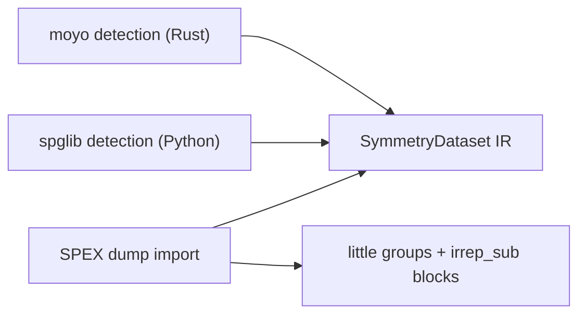

# Crystal symmetry and SPEX irrep import

This note fixes the method-neutral crystal symmetry boundary, its two
detection backends (moyo in Rust, spglib in Python), and the SPEX
compatibility mode that imports SPEX's own symmetry analysis and wavefunction
irreps instead of re-detecting them. It follows the formula / algorithm /
implementation layering of [18](18_lapw_mpb_thc_integration.md).

## Formulas

### Operation action

A space-group operation is a pair $(W, w)$ acting on fractional coordinates
of the input cell,

```math
x' = W x + w ,
```

with $W$ an integer matrix in the direct-lattice basis and $w$ fractional.
An antiunitary operation composes this action with complex conjugation
(time reversal). In reciprocal space the unitary action on a fractional
k-point is

```math
k' = (W^{-1})^{\mathrm{T}} k \; (\mathrm{mod}\ G) ,
```

and SPEX stores that reciprocal rotation explicitly as
`rrot = transpose(rot(inv))`, with an overall sign flip for time-reversal
operations. When the crystal lacks inversion (or spin–orbit coupling is
active without `TRSOFF`), SPEX doubles its operation list and flags the
appended copies as time-reversal operations; the little-group and k-parent
tables index into that doubled list, so the import preserves it verbatim.

### Degenerate-subspace irreps

For a degenerate band block $\{ \phi_i \}$ at k-point $k$ and a little-group
operation $S$ (an $S$ whose reciprocal action fixes $k$ modulo a reciprocal
lattice vector), SPEX computes the unitary block

```math
\Gamma_{ij}(S) = \langle \phi_i | P(S) | \phi_j \rangle ,
```

its `irrep_sub`. These blocks reduce BZ sums in exchange, susceptibility,
and BSE assembly. They are basis-dependent through SPEX's wavefunction phase
conventions, which is exactly why the compatibility mode imports them rather
than recomputing them: reproducing them requires SPEX's Wigner-D convention

```math
Y_{lm}(R^{-1} \hat{r}) = \sum_{m'} Y_{lm'}(\hat{r}) \, D^{l}_{m'm}(R)
```

(Brink–Satchler, `src/numerics.f:1192`), its muffin-tin transformation phase
$e^{-2\pi i\, k \cdot (t_{\mathrm{cent}} - w)}$, and conjugation before
transformation for time-reversal operations (`src/trafo.f:104`). A consumer
that mixes detected operations with imported irreps inherits a phase
mismatch; the two sources must not be interleaved within one analysis.

## Algorithm

The boundary is one IR with three producers:



- Detection produces unitary operations, orbit representatives, and a
  space-group classification from a crystal cell at a stated tolerance.
- Import copies the producing code's operation list (including any
  time-reversal doubling), atom map, k-parent tables, and per-k
  degenerate-subspace irreps, and never re-classifies. Orbit representatives
  are derived from the atom map: the representative of site $a$ is the
  minimum image of $a$ over all operations.
- All backends agree on the operation convention above; spglib and spgrep
  apply rotations as `rotations[i] @ x + translations[i]`, moyo returns the
  same layout via `rotation_as_array`, and the SPEX `rot`/`transl` pair is
  already in that basis.
- The Python SPEX-log `atom_map` matches periodic fractional coordinates with
  a Chebyshev residual threshold of `1e-6`. Rust
  `CrystalSymmetryTransform::from_cell` instead matches periodic Cartesian
  Euclidean distances against its caller-supplied tolerance in Bohr. The maps
  have the same index meaning, but their residuals and tolerance values are
  not interchangeable for cross-validation.

The import has two tiers:

- **Stdout tier (implemented).** SPEX prints its operation table (rotations,
  fractional translations, inverse indices, time-reversal flags), the atom
  basis, and the irreducible-BZ table into standard output; no SPEX
  modification is needed. `pymuffintin.spex_log` parses that text — the
  format is pinned against `print_symmetries` (`src/symmetry.f:480`):
  operations print in blocks of four, transposed across lines, with a
  fixed-width prefix and 18-character matrix-row groups — and exports a
  `libmuffintin.spexsym` v1 file whose k list is the IBZ and whose irreps
  section is empty. Space-group classification lines in the log are ignored
  by design: classification can depend on the origin shift, and the
  operation table itself is the authoritative object.
- **Dump tier (not implemented).** Wavefunction irreps never appear in
  stdout, so reusing `irrep_sub` requires a SPEX-side dump that forces the
  lazy irrep computation (`prepare_offdiag`) for every irreducible k-point,
  spin, and requested band window, then writes the versioned file below with
  all indices converted to 0-based. The existing frozen-snapshot writer
  pattern (schema-version attribute plus a schema-validation companion test)
  is the template. This tier is deferred until a consumer (BSE-style
  acceleration) actually needs it.

## Implementation

Rust IR: `muffintin_symmetry` root types `SymmetryOperation` (with
`time_reversal`), `SymmetryDataset`, `SymmetryProvenance`, `CrystalCell`;
detection in `moyo_backend::detect` behind the default `backend-moyo`
feature; import types in `spex::{SpexSymmetryImport, KpointIrreps,
SubspaceIrreps}` with `SpexSymmetryImport::dataset()` for the neutral view.
Python mirror: `pymuffintin.symmetry` (spglib detection, spgrep little-group
scalar and spinor irreps). File I/O: `muffintin_io::{read_spex_symmetry_v1,
write_spex_symmetry_v1}`; the Rust writer is the reference implementation
the future SPEX Fortran writer is diffed against.

### `libmuffintin.spexsym` v1 schema

Root attributes: `schema_name = "libmuffintin.spexsym"`, `schema_version = 1`
(u32), `producer_version` (string). Every dataset carries an `axes` string
attribute as listed. All indices 0-based; complex data uses a trailing
`[re, im]` axis.

| Location | Type, shape | Content |
|---|---|---|
| `/symmetry/rotations` | i32, `(nsym, 3, 3)` | $W$ per operation, rows `["operation", "row", "column"]` |
| `/symmetry/translations` | f64, `(nsym, 3)` | $w$ per operation, fractional |
| `/symmetry/time_reversal` | i32, `(nsym)` | 0/1 antiunitary flag |
| `/symmetry/inverse` | i32, `(nsym)` | index of the inverse operation |
| `/symmetry/atom_map` | i32, `(nsym, nsites)` | image site per operation and site (SPEX `pcent`) |
| `/kpoints@irreducible_count` | i64 attr | SPEX `nkpti`; irreducible points lead the list |
| `/kpoints/fractional` | f64, `(nkpt, 3)` | full-BZ fractional k-points in SPEX order |
| `/kpoints/parent` | i32, `(nkpt)` | irreducible parent (SPEX `kptp`) |
| `/kpoints/parent_operation` | i32, `(nkpt)` | operation mapping parent to point (SPEX `symkpt`) |
| `/irreps@block_count` | i64 attr | number of `(k, spin)` irrep blocks |
| `/irreps/block<n>@kpoint_index,@spin,@subspace_count` | i64 attrs | block identity |
| `/irreps/block<n>/little_group` | i32, `(nsym1)` | operation indices fixing $k$ modulo $G$ |
| `/irreps/block<n>/subspace<j>` | f64, `(nsym1, d, d, 2)` | one $\Gamma(S)$ block per little-group operation; attr `first_band` |

SPEX source anchors for the writer: operation storage `src/global.f:179`
(`symtype`), construction `src/symmetry.f:20` (`def_symmetry`), k tables
`src/defkpt.f:61` (`kptp`, `symkpt`, `kptsym`, `gkptsym`), irreps
`src/irreps.f:33` (`prepare_offdiag`, `irrep_sub`) with the degeneracy map
`deg` (`src/global.f:111`).

### Status and gates

| Item | State |
|---|---|
| Rust IR + moyo detection | tests: fcc primitive is #225 with 48 operations; rutile orbits split by species |
| Python detection + irreps | tests: Γ-point scalar and spinor irreps satisfy $\sum_\alpha d_\alpha^2 = 48$ |
| `spexsym` v1 reader/writer | roundtrip and index-validation tests in `crates/mt-io/tests/spex_symmetry_v1.rs` |
| SPEX stdout parser | `pymuffintin.spex_log` with an MnTe noncollinear fixture (8 magnetic operations, 4 time-reversal, 105-point IBZ); cross-language check: its `to_spexsym_v1` output is read back by `muffintin_io` (the ignored `SPEXSYM_FIXTURE` test) |
| SPEX-side irrep dump | not implemented; deferred until a BSE-style consumer needs `irrep_sub` |
| Consumption in SCF / BZ reduction | implemented for regular-mesh scalar nonmagnetic LAPW SCF: exact orbit weights, full-mesh density layout, post-core regional projection, and checkpoint provenance; SOC/noncollinear consumption remains deferred |
