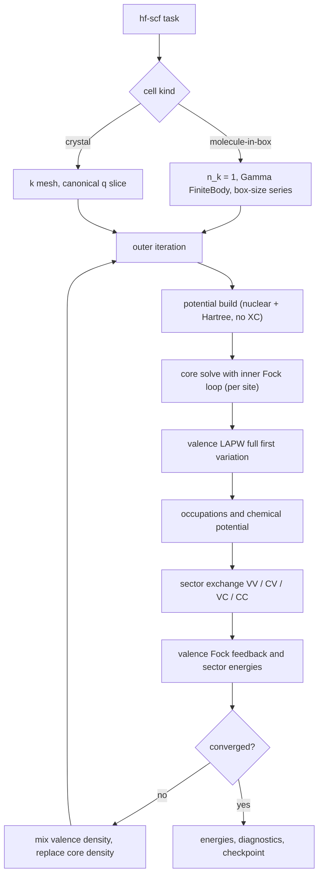

# 23. Core–valence exchange and the unified Hartree–Fock driver

This document is a contract: formulas, IR shapes, stage boundaries, and
acceptance gates. It changes no production code. It defines the plan that
lifts two explicit exclusions of [18](18_lapw_mpb_thc_integration.md) §4 —
core–valence products and the self-consistent Fock loop — and it replaces the
earlier frozen-core staging idea with a relaxed core at FlapwMBPT parity.
The route is spinor-first: the core is inherently four-component Dirac
([06](06_dirac_4c_core_and_valence.md)), so the first implementation targets
the full-first-variation spinor valence path; a scalar-relativistic HF route
is derived later or not at all. The mixed-product basis is the exact oracle
throughout; THC never defines a sector, it only compresses one.

## 1. Formulas

### 1.1 Occupied-space decomposition and sector energies

Let $D=D_v+D_c$ split the occupied one-particle density into valence and core
parts, and let $K_B[D_A]$ denote the exchange operator generated by occupied
space $A$ and restricted to target space $B$, with $A,B\in\{v,c\}$ and the
negative sign included in $K$:

```math
K_v=K_v[D_v]+K_v[D_c],\qquad
K_c=K_c[D_v]+K_c[D_c].
```

The exchange energy is accounted per sector:

```math
E_x^{vv}=\frac{1}{2}\,\mathrm{Tr}\left(D_v K_v[D_v]\right),\qquad
E_x^{cc}=\frac{1}{2}\,\mathrm{Tr}\left(D_c K_c[D_c]\right),
```

```math
E_x^{cv}=\frac{1}{2}\left[\mathrm{Tr}\left(D_v K_v[D_c]\right)
+\mathrm{Tr}\left(D_c K_c[D_v]\right)\right].
```

The two cross traces are equal in exact arithmetic. Results must store both
traces, their average, and the mismatch residual, so the core–valence factor
of $1/2$ is never ambiguous. The total is $E_x=E_x^{vv}+E_x^{cv}+E_x^{cc}$.

The total Hartree–Fock energy uses the direct functional traces, never the
core eigenvalues of the channel-reduced core equation (section 1.4):

```math
E_{\mathrm{HF}}
=\mathrm{Tr}\left[(D_v+D_c)\,h\right]
+E_H[n_v+n_c]
+E_x^{vv}+E_x^{cv}+E_x^{cc}
+E_{\mathrm{nn}},
```

with $h$ the kinetic plus external one-body operator, $E_H$ the Hartree
energy of the total density, and $E_{\mathrm{nn}}$ the periodic Ewald or
molecular nuclear repulsion. The valence eigenvalue identity

```math
\sum_{i\in v} f_i\,\varepsilon_i
=\mathrm{Tr}\left(D_v h\right)
+\mathrm{Tr}\left(D_v V_H\right)
+\mathrm{Tr}\left(D_v K_v\right)
```

is a consistency gate; the analogous core identity carries the sphericity
error of section 1.4 and its residual is a reported diagnostic, not a gate.

### 1.2 Core shells, Bloch phase, and spill

A core spin orbital is identified by $(s,n,\kappa,2\mu)$: site, principal
quantum number, signed Dirac $\kappa$, and doubled magnetic quantum number.
The physical radial pair $(P_c,Q_c)$ is shared per shell $(s,n,\kappa)$ and
the $\mu$ degeneracy is expanded explicitly. Each spin orbital carries an
occupation $f\in[0,1]$; a closed shell has $f=1$ for every one of its
$2|\kappa|$ spin orbitals. Neither a spherically averaged core density nor a
pseudocharge may be inverted into exchange input, and a core normalized over
all space is never silently renormalized inside the muffin tin.

Core states enter the periodic problem as flat Bloch bands,

```math
\varphi_{ck}(r)=\frac{1}{\sqrt{N}}\sum_{R}
e^{ik\cdot(R+\tau_s)}\,\varphi_c(r-R-\tau_s),
```

with occupations and density independent of $k$; only the site phase depends
on $k$. This form, and the muffin-tin-only pair vertices of section 1.3, are
valid exactly when the core does not leak between images. The solver already
works on an extended mesh and reports `norm_total`, `norm_mt`, and `spill`;
the contract makes spill a gated diagnostic. A shell whose spill exceeds the
gate must be reclassified as valence or semicore (the FlapwMBPT `core_lim` /
`core_bcs` reclassification precedent), never truncated silently.

### 1.3 Rectangular sector contraction

Exchange pairs are rectangular: the occupied index and the target index run
over different spaces. The four sectors are

| Sector | Occupied space $A$ (at $k-q$) | Target space $B$ (at $k$) | Feeds |
|---|---|---|---|
| VV | valence bands | valence bands | $K_v[D_v]$ |
| CV | core spin orbitals | valence bands | $K_v[D_c]$ |
| VC | valence bands | core spin orbitals | $K_c[D_v]$ |
| CC | core spin orbitals | core spin orbitals | $K_c[D_c]$ |

The single contraction formula extends
[18](18_lapw_mpb_thc_integration.md) §2.8 to any sector:

```math
K^{x,AB}_{jj'}(k)
=-\sum_{q} w_{k-q}\sum_{i\in A} f^{A}_{i}(k-q)
\left(C^{q,AB}_{kij}\right)^{\dagger} V^{q}\, C^{q,AB}_{kij'},
\qquad j,j'\in B,
```

where $C^{q,AB}_{kij}$ is the auxiliary-basis vertex of the pair formed by
occupied state $i\in A$ at $k-q$ and target state $j\in B$ at $k$, and $V^q$
is the sampled $\zeta$ Weinert Coulomb operator of
[15](15_weinert_coulomb_metric.md). For $A=c$ the occupied index enumerates
$(s,n,\kappa,2\mu)$, $f^{c}_{i}$ does not depend on $k-q$, and only the site
phase of the vertex does. Because the core radial support ends at the
muffin-tin boundary (up to gated spill), every vertex with a core member is
muffin-tin only: its interstitial pair contraction is identically zero, and
the raw interstitial pair support of such columns is empty by contract.

Sector traces close the energy accounting of section 1.1:

```math
T_{AB}=\sum_{k} w_k\sum_{j\in B} f^{B}_{j}(k)\,K^{x,AB}_{jj}(k),
```

so $E_x^{vv}=\frac{1}{2}T_{vv}$, $E_x^{cc}=\frac{1}{2}T_{cc}$,
$E_x^{cv}=\frac{1}{2}(T_{cv}+T_{vc})$, and the stored cross-trace residual is
$|T_{cv}-T_{vc}|$.

The pair sectors follow the spinor conventions of
[18](18_lapw_mpb_thc_integration.md) §1.3: PP and QQ charge sectors only,
physical $P$ and $Q$, no $cQ$, no PQ/QP mixing.

### 1.4 Relaxed-core radial Fock equation

The core is relaxed: every outer iteration re-solves each core shell in the
current potential. In Hartree–Fock the core equation is

```math
\left(\hat h^{\mathrm{Dirac}}\!\left[V^{\mathrm{loc}}\right]
+\hat K^{\mathrm{sph}}_c\right)\varphi_c=\varepsilon_c\,\varphi_c,
```

where $\hat h^{\mathrm{Dirac}}$ is the radial four-component operator of
[06](06_dirac_4c_core_and_valence.md), $V^{\mathrm{loc}}$ is the spherical
nuclear plus Hartree potential of the full density on the extended mesh —
with no exchange–correlation surrogate — and $\hat K^{\mathrm{sph}}_c$ is the
channel-reduced exchange kernel. Its core–core part is the relativistic
closed-subshell Slater form: with

```math
Y_L(c',c;r)=\int_0^{\infty}
\frac{\min(r,r')^{L}}{\max(r,r')^{L+1}}
\left[P_{c'}(r')P_c(r')+Q_{c'}(r')Q_c(r')\right]dr',
```

the kernel acting on $P_c$ is
$-\sum_{c'}\sum_L A_L(\kappa_c,\kappa_{c'})\,Y_L(c',c;r)\,P_{c'}(r)/r$,
with the same kernel multiplying $Q_{c'}$ in the small-component equation and
$A_L$ the closed-subshell-averaged Dirac angular factor. The core–valence
part is built from the site-projected occupied valence density matrix,
reduced to $l/\kappa$ channels by the same Clebsch–Gordan contraction
(the FlapwMBPT `t_x`/`t1_x` construction); the valence input itself is not
spherically restricted — only the operator acting on the core is. The core
solve iterates this kernel to inner self-consistency per shell.

The channel reduction is forced by solving a one-dimensional radial equation.
Two exactness statements bound its cost:

- For uniform $\mu$ occupation per shell (spherical $D_c$), every energy
  trace of section 1.1 picks up only the spherical component of the exchange
  operator, so the traces from the radial Slater route and from the exact
  rectangular MPB route agree in exact arithmetic. Their difference is a
  numerical gate, not a model tolerance.
- The neglected nonspherical remainder affects only core orbital relaxation
  in a nonspherical environment. It is measured, per core spin orbital, as

```math
\delta_c=\langle\varphi_c|\,K_c^{\mathrm{exact}}-K_c^{\mathrm{sph}}\,
|\varphi_c\rangle,
```

  with $K_c^{\mathrm{exact}}$ evaluated through the MPB VC/CC vertices.
  $\delta_c$ is reported every iteration; an exact nonlocal core solve is out
  of scope (section 5).

### 1.5 Gamma and the core–valence constant mode

At $q\to0$ the auxiliary constant mode couples to the pair charge
$\langle\varphi_c|\varphi_v\rangle$. For orthogonal core and valence states
this head coupling vanishes; LAPW core–valence orthogonality is approximate
because core and valence solve different equations, so the constant-mode
component of every CV/VC vertex is measured and gated rather than assumed
zero. The Gamma policy of [18](18_lapw_mpb_thc_integration.md) §2.8 is
unchanged: explicit `FiniteBody` (molecule-in-box neutralizing-background
convention, cell-size convergence checked by the caller) or `Reject`. No
divergent head is inserted, and analytic head integration stays deferred.
A converged crystal claim therefore requires a stated $k$ mesh; this contract
does not call the finite-mesh result a production periodic HF limit.

## 2. Algorithms

### 2.1 One driver for the Gamma molecule and the crystal

There is one Hartree–Fock driver. A Gamma-centered molecule-in-box and a
periodic crystal differ only in setup, never in the loop body or the
contraction path:



The AO restricted Hartree–Fock in `libmuffintin-hf` is not this driver and
never becomes it: it stays a molecular finite-basis oracle for cross-code
comparison (the Kr Dyall v2z fixture). The production molecule path is the
LAPW driver at $n_k=1$.

### 2.2 Relaxed-core outer iteration and mixing

Each outer iteration, in order: rebuild the local potential from the current
total density; re-solve every core shell with the inner exchange loop of
section 1.4; solve the valence problem with the Fock feedback
$K_v[D_v]+K_v[D_c]$ from the previous iteration's orbitals; form occupations;
rebuild all four exchange sectors; synthesize the density.

Mixing follows the FlapwMBPT contract: the core density is excluded from
Pulay/Anderson mixing and is replaced fresh each iteration; only the valence
part of the regional density is mixed under the physical metric of
[17](17_minimal_dft_scf.md) §3. If density mixing of the Fock fixed point
proves unstable, Hartree-potential mixing (the FlapwMBPT non-DFT stage
choice) is the recorded fallback, as an explicit spec change rather than a
silent switch. Core convergence is reported as the maximum radial change over
shells, alongside the density metric and the sector energies.

### 2.3 MPB exact oracle first, THC second

All four sectors are first realized as exact mixed-product vertices over the
rectangular layouts, extending the selected core–valence products already
encoded in [13](13_product_space_and_lapw_mpb.md) §4 to a real runtime core
producer and a CC enumeration. Only after the rectangular oracle passes its
gates is THC selection and fitting extended to core-aware columns. THC must
then report `residual_vv`, `residual_cv`, `residual_vc`, and `residual_cc`
separately against the MPB oracle — a single pooled residual would let the
more numerous VV columns dominate AllQL2 selection and hide a bad core fit.

## 3. Implementation

Bindings named here are planned unless marked existing. No production code
changes with this document.

### 3.1 Existing seams

| Seam | Anchor | Status |
|---|---|---|
| Core radial solve | `solve_core_dirac`, `CoreDiracSolution` in `crates/mt-sphere/src/core_dirac.rs` | exists; reports physical $P/Q$, `norm_mt`, `spill` |
| Per-iteration core station | `solve_regional_core` in `crates/mt-dft/src/core_station.rs` | exists; discards $P/Q$ after density synthesis |
| Core radials in the product IR | `DiracSiteRadialSet::cores`, `ProductOrbitalKind::Core` in `crates/mt-prodbasis/src/dirac.rs` | exists; runtime emits empty `cores` |
| Exchange contraction | `build_scalar_isdf_exchange`, `build_spinor_isdf_exchange`, `GammaExchangeTreatment` in `crates/mt-runtime/src/isdf_exchange.rs` | exists; square valence layout only |
| Sharp-core fixture flag | `PairColumnLayout::core_orbital` in `crates/mt-prodbasis/src/pair_layout.rs` | fixture-only; must not model real cores |
| Molecular AO oracle | `solve_restricted_hf` in `crates/mt-hf/src/lib.rs` | exists; external comparison only |

### 3.2 Planned IR

The core station keeps what it already computes instead of discarding it:

```text
CoreShellOrbitals                  (one site)
├─ site_index, site_id
├─ extended_mesh                   (beyond the muffin-tin radius)
├─ shells: [CoreShellOrbital]
│   ├─ state (n, kappa), energy
│   ├─ p, q                        (physical P/Q on extended_mesh)
│   ├─ norm_total, norm_mt, spill
│   └─ occupations: [(twice_mu, f)]
└─ provenance                      (potential build and solve spec identity)
```

Rectangular sectors get their own layout; `PairColumnLayout` and its
`core_orbital` fixture flag stay untouched:

```text
ExchangePairLayout
├─ occupied_space: ExchangeSpace   (Valence | Core)
├─ target_space:   ExchangeSpace
├─ n_k, n_occupied, n_target
└─ column = (k, i, j)              (i occupied at k-q, j target at k)
```

The exchange spec grows sector-aware occupations: the valence table keeps the
existing per-$k$ rows; the core table is one $k$-independent row of
$(s,n,\kappa,2\mu)$ occupations. The runtime spinor product input fills
`DiracSiteRadialSet::cores` from the `CoreShellOrbitals` sidecar; per the
muffin-tin-only contract of section 1.3, core-member columns carry empty raw
interstitial pair support.

### 3.3 FlapwMBPT reference anchors

Verified against the local source tree `FlapwMBPT.2106` (see
`AGENTS.local.md` for the archive location); paths are relative to that root.

| Contract point | FlapwMBPT anchor |
|---|---|
| Core re-solved every iteration in HF | `src/core_all.F` called unconditionally from the `src/solid_scf.F` main loop |
| Core sees Hartree plus explicit exchange, no XC surrogate | `src/cor_new.F` (`key1=1` branch), `src/f_ex_new.F` |
| Channel-reduced radial exchange kernels, CC and CV | `src/t_t1_x.F` (`t_x`, `t1_x`) with full valence density-matrix input |
| Exact nonlocal CV exchange in the valence Fock matrix | `src/sigx_cor_ar.F` accumulated with VV in `src/sigx_bnd_a_box.F`, rebuilt via `src/update_sx.F` |
| Core density excluded from mixing, fresh replacement | `src/mixro1.F` subtract-then-restore around Pulay mixing |
| Muffin-tin-confined core with decay diagnostics | `src/cor_new.F` (`psi_nre`, `r_nre_core`), `src/rad_hf_check.F` |

One deliberate divergence: FlapwMBPT builds CV exchange from direct on-site
Slater integrals and bypasses its mixed basis; this contract routes all four
sectors through the MPB auxiliary basis so the same Coulomb operator, Gamma
policy, and THC compression cover every sector, and so inter-site CV coupling
needs no separate machinery. The FlapwMBPT route confirms that muffin-tin-only
CV exchange is adequate under a spill gate.

## 4. Milestones and acceptance gates

| Milestone | Deliverable | Exit gates |
|---|---|---|
| M0 | Core station retains and outputs the `CoreShellOrbitals` sidecar | sidecar radials bit-identical to the density path; `norm_mt` and spill reported per shell; no consumer change |
| M1 | Rectangular MPB CV/VC/CC vertices over `ExchangePairLayout`; runtime core producer fills `DiracSiteRadialSet::cores` | cross-trace residual at numerical tolerance; occupation factors applied exactly once; PP/QQ sectors only; Bloch/site phase locked by a single-shell analytic fixture; CV constant-mode residual reported |
| M2 | Sector-aware one-shot exchange energies $E_x^{vv},E_x^{cv},E_x^{cc}$ on converged DFT orbitals, molecule and crystal | VV sector reproduces the existing square contraction; closed-shell CC trace from the radial Slater route matches the MPB CC trace within the spill allowance |
| M3 | Unified `hf-scf` driver with relaxed core at FlapwMBPT parity (sections 1.4, 2.1, 2.2) | fixed point under the doc/17 density metric; valence eigenvalue identity of section 1.1; $\delta_c$ and core convergence reported per iteration; fresh-core replacement mixing; molecule route compared against the AO oracle fixture |
| M4 | Core-aware THC selection and fit, MPB as oracle | `residual_vv/cv/vc/cc` reported separately; core columns never dropped by pooled selection; rank scaling reported |
| M5 | MLDUMP/pyexport v2 with sector energies and exchange provenance | schema versioned; v1 files remain exchange-absent |

M3 bring-up may run the driver against a core solved in the current
DFT-style local potential to isolate valence Fock machinery, but that
configuration is a test harness only: it carries an uncancelled core
self-interaction and is not a shippable mode. The production exit criterion
for M3 is the relaxed Fock core.

## 5. Explicit exclusions

This contract does not include:

- an exact nonlocal core equation beyond the channel-reduced kernel; the
  remainder is measured by $\delta_c$, not modeled;
- core rotation into the valence window (semicore promotion is
  reclassification, not hybridization);
- analytic Gamma-head integration, truncated or isolated Coulomb kernels,
  and any claim of a converged periodic HF limit at a fixed $k$ mesh;
- a scalar-relativistic HF route (spinor-first);
- core contributions to polarizability or screening (the FlapwMBPT
  `core_corr` analogue belongs to a later GW/RPA contract);
- forces, and any MLDUMP/pyexport schema change before M5;
- retiring or extending the AO oracle in `libmuffintin-hf` beyond its
  comparison role.
