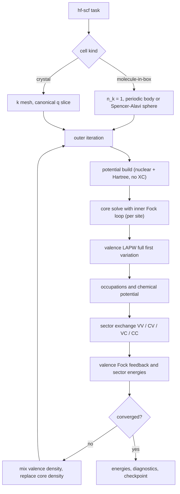
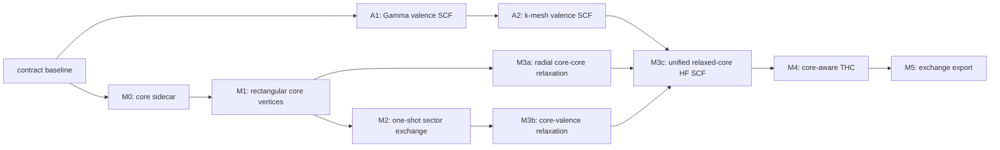

# 23. Core–valence exchange and the unified Hartree–Fock driver

This document is a contract: formulas, IR shapes, stage boundaries, and
acceptance gates. A1 and A2 are implemented as described in section 4.1, and
M0, M1, and M2 are implemented as described in section 4.2. M3a and M3b are
also implemented, including the shared relaxed-core loop with fresh CC and VC
actions at every inner iteration. M3c now closes the repository-internal
unified driver and its bounded synthetic pipeline; the external Kr AO comparison
remains blocked as recorded below. M4 core-aware THC and the M5 versioned
exchange export are implemented on the final rebuilt relaxed-core frame. The
contract lifts two explicit exclusions of
[18](18_lapw_mpb_thc_integration.md) §4 —
core–valence products and the self-consistent Fock loop — and it replaces the
earlier frozen-core staging idea with a relaxed core at FlapwMBPT parity.
The core is inherently four-component Dirac
([06](06_dirac_4c_core_and_valence.md)). The original implementation targets
the full-first-variation spinor valence path. A separate valence-only route now
converges scalar Koelling–Harmon HF before applying conventional SOC second
variation; its core-sector extension is specified below rather than
reinterpreting full-first-variation orbitals. The mixed-product basis is the
exact oracle throughout; THC never defines a sector, it only compresses one.

## 1. Formulas

### 1.1 Occupied-space decomposition and sector energies

Let $D=D_v+D_c$ split the occupied one-particle density into valence and core
parts, and let $K_B[D_A]$ denote the exchange operator generated by occupied
space $A$ and restricted to target space $B$, with $A,B\in\{v,c\}$ and the
negative sign included in $K$:

```math
K_v=K_v[D_v]+K_v[D_c],\qquad
K_c=K_c[D_v]+K_c[D_c].
```

The exchange energy is accounted per sector:

```math
E_x^{vv}=\frac{1}{2}\,\mathrm{Tr}\left(D_v K_v[D_v]\right),\qquad
E_x^{cc}=\frac{1}{2}\,\mathrm{Tr}\left(D_c K_c[D_c]\right),
```

```math
E_x^{cv}=\frac{1}{2}\left[\mathrm{Tr}\left(D_v K_v[D_c]\right)
+\mathrm{Tr}\left(D_c K_c[D_v]\right)\right].
```

The two cross traces are equal in exact arithmetic. Results must store both
traces, their average, and the mismatch residual, so the core–valence factor
of $1/2$ is never ambiguous. The total is $E_x=E_x^{vv}+E_x^{cv}+E_x^{cc}$.

The total Hartree–Fock energy uses the direct functional traces, never the
core eigenvalues of the channel-reduced core equation (section 1.4):

```math
E_{\mathrm{HF}}
=\mathrm{Tr}\left[(D_v+D_c)\,h\right]
+E_H[n_v+n_c]
+E_x^{vv}+E_x^{cv}+E_x^{cc}
+E_{\mathrm{nn}},
```

with $h$ the kinetic plus external one-body operator, $E_H$ the Hartree
energy of the total density, and $E_{\mathrm{nn}}$ the periodic Ewald or
molecular nuclear repulsion. The valence eigenvalue identity

```math
\sum_{i\in v} f_i\,\varepsilon_i
=\mathrm{Tr}\left(D_v h\right)
+\mathrm{Tr}\left(D_v V_H\right)
+\mathrm{Tr}\left(D_v K_v\right)
```

is a consistency gate; the analogous core identity carries the sphericity
error of section 1.4 and its residual is a reported diagnostic, not a gate.

### 1.2 Core shells, Bloch phase, and spill

A core spin orbital is identified by $(s,n,\kappa,2\mu)$: site, principal
quantum number, signed Dirac $\kappa$, and doubled magnetic quantum number.
The physical radial pair $(P_c,Q_c)$ is shared per shell $(s,n,\kappa)$ and
the $\mu$ degeneracy is expanded explicitly. Each spin orbital carries an
occupation $f\in[0,1]$; a closed shell has $f=1$ for every one of its
$2|\kappa|$ spin orbitals. Neither a spherically averaged core density nor a
pseudocharge may be inverted into exchange input, and a core normalized over
all space is never silently renormalized inside the muffin tin.

Core states enter the periodic problem as flat Bloch bands,

```math
\varphi_{ck}(r)=\frac{1}{\sqrt{N}}\sum_{R}
e^{ik\cdot(R+\tau_s)}\,\varphi_c(r-R-\tau_s),
```

with occupations and density independent of $k$; only the site phase depends
on $k$. This form, and the muffin-tin-only pair vertices of section 1.3, are
valid exactly when the core does not leak between images. The solver already
works on an extended mesh and reports `norm_total`, `norm_mt`, and `spill`;
the contract makes spill a gated diagnostic. A shell whose spill exceeds the
gate must be reclassified as valence or semicore (the FlapwMBPT `core_lim` /
`core_bcs` reclassification precedent), never truncated silently.

### 1.3 Rectangular sector contraction

Exchange pairs are rectangular: the occupied index and the target index run
over different spaces. The four sectors are

| Sector | Occupied space $A$ (at $k-q$) | Target space $B$ (at $k$) | Feeds |
|---|---|---|---|
| VV | valence bands | valence bands | $K_v[D_v]$ |
| CV | core spin orbitals | valence bands | $K_v[D_c]$ |
| VC | valence bands | core spin orbitals | $K_c[D_v]$ |
| CC | core spin orbitals | core spin orbitals | $K_c[D_c]$ |

The single contraction formula extends
[18](18_lapw_mpb_thc_integration.md) §2.8 to any sector:

```math
K^{x,AB}_{jj'}(k)
=-\sum_{q} w_{k-q}\sum_{i\in A} f^{A}_{i}(k-q)
\left(C^{q,AB}_{kij}\right)^{\dagger} V^{q}\, C^{q,AB}_{kij'},
\qquad j,j'\in B,
```

where $C^{q,AB}_{kij}$ is the auxiliary-basis vertex of the pair formed by
occupied state $i\in A$ at $k-q$ and target state $j\in B$ at $k$, and $V^q$
is the sampled $\zeta$ Weinert Coulomb operator of
[15](15_weinert_coulomb_metric.md). For $A=c$ the occupied index enumerates
$(s,n,\kappa,2\mu)$, $f^{c}_{i}$ does not depend on $k-q$, and only the site
phase of the vertex does. Because the core radial support ends at the
muffin-tin boundary (up to gated spill), every vertex with a core member is
muffin-tin only: its interstitial pair contraction is identically zero, and
the raw interstitial pair support of such columns is empty by contract.

Sector traces close the energy accounting of section 1.1:

```math
T_{AB}=\sum_{k} w_k\sum_{j\in B} f^{B}_{j}(k)\,K^{x,AB}_{jj}(k),
```

so $E_x^{vv}=\frac{1}{2}T_{vv}$, $E_x^{cc}=\frac{1}{2}T_{cc}$,
$E_x^{cv}=\frac{1}{2}(T_{cv}+T_{vc})$, and the stored cross-trace residual is
$|T_{cv}-T_{vc}|$.

The pair sectors follow the spinor conventions of
[18](18_lapw_mpb_thc_integration.md) §1.3: PP and QQ charge sectors only,
physical $P$ and $Q$, no $cQ$, no PQ/QP mixing.

### 1.4 Relaxed-core radial Fock equation

The core is relaxed: every outer iteration re-solves each core shell in the
current potential. In Hartree–Fock the core equation is

```math
\left(\hat h^{\mathrm{Dirac}}\!\left[V^{\mathrm{loc}}\right]
+\hat K^{\mathrm{sph}}_c\right)\varphi_c=\varepsilon_c\,\varphi_c,
```

where $\hat h^{\mathrm{Dirac}}$ is the radial four-component operator of
[06](06_dirac_4c_core_and_valence.md), $V^{\mathrm{loc}}$ is the spherical
nuclear plus Hartree potential of the full density on the extended mesh —
with no exchange–correlation surrogate — and $\hat K^{\mathrm{sph}}_c$ is the
channel-reduced exchange kernel. Its core–core part is the relativistic
closed-subshell Slater form. Production keeps the two charge sectors distinct:

```math
Y_L^{PP}(c',c;r)=\int_0^{\infty}
\frac{\min(r,r')^{L}}{\max(r,r')^{L+1}}
P_{c'}(r')P_c(r')\,dr',
```

```math
Y_L^{QQ}(c',c;r)=\int_0^{\infty}
\frac{\min(r,r')^{L}}{\max(r,r')^{L+1}}
Q_{c'}(r')Q_c(r')\,dr'.
```

PP angular contractions use $\Omega_\kappa$ and QQ contractions use
$\Omega_{-\kappa}$. Their contributions to the P and Q output actions are
formed separately, and their Coulomb interference is retained in the total
trace; no one combined $Y_L^{PP+QQ}$ or common angular factor is used. The
core–valence part is built from the site-projected occupied valence density matrix,
reduced to $l/\kappa$ channels by the same Clebsch–Gordan contraction
(the FlapwMBPT `t_x`/`t1_x` construction); the valence input itself is not
spherically restricted — only the operator acting on the core is. The core
solve iterates this kernel to inner self-consistency per shell.

The channel reduction is forced by solving a one-dimensional radial equation.
Two statements bound its cost and comparison scope:

- For uniform $\mu$ occupation per shell (spherical $D_c$), every energy
  trace of section 1.1 picks up only the spherical component of the exchange
  operator. Traces agree in exact arithmetic only when both routes use the
  same Coulomb body. The production MPB `FiniteBody` contraction includes the
  finite periodic/background body with the separated divergent Gamma head
  omitted, while the radial Slater route uses isolated onsite $1/r$.
  MPB-minus-radial CC/CV/VC values are therefore signed physical diagnostics,
  not numerical gates. The sampled radial action and its independent extended
  radial trace do use the same body and retain a numerical identity gate.
- The neglected nonspherical remainder affects only core orbital relaxation
  in a nonspherical environment. It is measured, per core spin orbital, as

```math
\delta_c=\langle\varphi_c|\,K_c^{\mathrm{exact}}-K_c^{\mathrm{sph}}\,
|\varphi_c\rangle,
```

  with $K_c^{\mathrm{exact}}$ evaluated through the MPB VC/CC vertices.
  $\delta_c$ is reported every iteration; an exact nonlocal core solve is out
  of scope (section 5).

### 1.5 Gamma and the core–valence constant mode

At $q\to0$ the auxiliary constant mode couples to the pair charge
$\langle\varphi_c|\varphi_v\rangle$. For orthogonal core and valence states
this head coupling vanishes; LAPW core–valence orthogonality is approximate
because core and valence solve different equations, so the constant-mode
component of every CV/VC vertex is measured and gated rather than assumed
zero. The Gamma policy of [18](18_lapw_mpb_thc_integration.md) §2.8 is
unchanged for the periodic kernel: explicit `FiniteBody`
(neutralizing-background convention) or `Reject`. A molecule may instead
select `CoulombKernel::SpencerAlaviSphere`, whose Gamma kernel is finite and
has no separated head. Cell size and the explicit auxiliary Fourier cutoff are
then both caller convergence parameters. No divergent head is inserted.
A converged crystal claim therefore requires a stated $k$ mesh; this contract
does not call the finite-mesh result a production periodic HF limit.

## 2. Algorithms

### 2.1 One driver for the Gamma molecule and the crystal

There is one Hartree–Fock driver. A Gamma-centered molecule-in-box and a
periodic crystal differ only in setup, never in the loop body or the
contraction path:



The AO restricted Hartree–Fock in `libmuffintin-hf` is not this driver and
never becomes it: it stays a molecular finite-basis oracle for cross-code
comparison (the Kr Dyall v2z fixture). The production molecule path is the
LAPW driver at $n_k=1$.

### 2.2 Relaxed-core outer iteration and mixing

Each outer iteration, in order: rebuild the local potential from the current
total density; re-solve every core shell with the inner exchange loop of
section 1.4; solve the valence problem with the Fock feedback
$K_v[D_v]+K_v[D_c]$ from the previous iteration's orbitals; form occupations;
rebuild all four exchange sectors; synthesize the density.

As a deliberate repository M3c design, the core density is excluded from
Pulay/Anderson mixing and is replaced fresh each iteration; only the valence
part of the regional density is mixed under the physical metric of
[17](17_minimal_dft_scf.md) §3. If density mixing of the Fock fixed point
proves unstable, Hartree-potential mixing (the FlapwMBPT non-DFT stage
choice) is the recorded fallback, as an explicit spec change rather than a
silent switch. Core convergence is reported as the maximum radial change over
shells, alongside the density metric and the sector energies.

### 2.3 MPB exact oracle first, THC second

All four sectors are first realized as exact mixed-product vertices over the
rectangular layouts, extending the selected core–valence products already
encoded in [13](13_product_space_and_lapw_mpb.md) §4 to a real runtime core
producer and a CC enumeration. Only after the rectangular oracle passes its
gates is THC selection and fitting extended to core-aware columns. THC must
then report `residual_vv`, `residual_cv`, `residual_vc`, and `residual_cc`
separately against the MPB oracle — a single pooled residual would let the
more numerous VV columns dominate AllQL2 selection and hide a bad core fit.

## 3. Implementation

Bindings named here are planned unless marked existing or assigned to the
implemented A1, A2, or M0–M3c milestones.

### 3.1 Existing seams

| Seam | Anchor | Status |
|---|---|---|
| Core radial solve | `solve_core_dirac`, `CoreDiracSolution` in `crates/mt-sphere/src/core_dirac.rs` | exists; reports physical $P/Q$, `norm_mt`, `spill` |
| Per-iteration core station | `solve_regional_core`, `CoreShellOrbitals` in `crates/mt-dft/src/core_station.rs` | M0; retains physical $P/Q$, occupations, norms, spill, and provenance beside the unchanged density path |
| Core radials in the product IR | `DiracSiteRadialSet::cores`, `ProductOrbitalKind::Core` in `crates/mt-prodbasis/src/dirac.rs` | M1; runtime fills the core table from the retained sidecar |
| Rectangular sector layout and vertices | `ExchangePairLayout` in `crates/mt-prodbasis/src/pair_layout.rs`, `build_spinor_exchange_mpb` in `crates/mt-runtime/src/spinor_exchange_mpb.rs` | M1; independent CV, VC, and CC layouts with muffin-tin PP/QQ core products |
| Exchange contraction | `build_scalar_isdf_exchange`, `build_spinor_isdf_exchange`, `contract_rectangular_exchange` in `crates/mt-runtime/src/isdf_exchange.rs` | exists; square valence and rectangular occupied-target contractions |
| Exact full-VV exchange | `build_spinor_mpb_exchange` in `crates/mt-runtime/src/isdf_exchange.rs` | A1; requires every VV column exactly once and seals the full live orbital payload |
| Nonorthogonal feedback lift | `lift_band_hermitian_feedback` in `crates/mt-operators/src/eigensolve.rs` | A1; forms `S C K C^H S` and re-solves the retained original H0/S problem |
| Gamma valence HF driver | `run_gamma_valence_hf` in `crates/mt-runtime/src/hf_scf.rs` | A1; spinor-first, one k point, finite Gamma body, no core states |
| Full-BZ valence HF engine | `run_valence_hf` in `crates/mt-runtime/src/hf_scf.rs` | A2; explicit full regular mesh, complete fresh canonical q slice, no core states |
| Unified relaxed-core HF engine | `run_relaxed_core_hf` in `crates/mt-runtime/src/hf_scf.rs` | M3c; the Gamma wrapper validates only the molecule topology and explicit `FiniteBody`, then calls this same regular-mesh loop |
| Split initial HF density and no-XC core bootstrap | `initial_density_components`, `bootstrap_hf_core` in `crates/mt-dft/src/material_kernel.rs` | M3c; preserves separate valence/core/total state and builds core sidecars from nuclear plus Hartree electrostatics |
| Fresh relaxed-core density and direct core H0 trace | `build_regional_core_contribution_from_sidecar`, `core_local_one_body_trace` in `crates/mt-dft/src/core_station.rs` | M3c; consumes retained physical sidecars without reconstruction or core-eigenvalue energy substitution |
| Frozen sector exchange | `build_frozen_spinor_sector_exchange` in `crates/mt-runtime/src/spinor_sector_exchange.rs` | M2; one-shot VV/CV/VC/CC accounting on one sealed frozen snapshot |
| Independent radial comparison | `radial_slater_traces` in `crates/mt-coulomb`, `compare_frozen_sector_radial` in `crates/mt-runtime/src/spinor_sector_exchange.rs` | M2; trace-only MT oracle with numerical and spill gates kept separate |
| Sharp-core fixture flag | `PairColumnLayout::core_orbital` in `crates/mt-prodbasis/src/pair_layout.rs` | fixture-only; must not model real cores |
| Molecular AO oracle | `solve_restricted_hf` in `crates/mt-hf/src/lib.rs` | exists; external comparison only |

### 3.2 Planned IR

The core station keeps what it already computes instead of discarding it:

```text
CoreShellOrbitals                  (one site)
├─ site_index, site_id
├─ extended_mesh                   (beyond the muffin-tin radius)
├─ shells: [CoreShellOrbital]
│   ├─ state (n, kappa), energy
│   ├─ p, q                        (physical P/Q on extended_mesh)
│   ├─ norm_total, norm_mt, spill
│   └─ occupations: [(twice_mu, f)]
└─ provenance                      (potential build and solve spec identity)
```

Rectangular sectors get their own layout; `PairColumnLayout` and its
`core_orbital` fixture flag stay untouched:

```text
ExchangePairLayout
├─ occupied_space: ExchangeSpace   (Valence | Core)
├─ target_space:   ExchangeSpace
├─ n_k, n_occupied, n_target
└─ column = (k, i, j)              (i occupied at k-q, j target at k)
```

The exchange spec grows sector-aware occupations: the valence table keeps the
existing per-$k$ rows; the core table is one $k$-independent row of
$(s,n,\kappa,2\mu)$ occupations. The runtime spinor product input fills
`DiracSiteRadialSet::cores` from the `CoreShellOrbitals` sidecar; per the
muffin-tin-only contract of section 1.3, core-member columns carry empty raw
interstitial pair support.

### 3.3 FlapwMBPT reference anchors

Verified against the local source tree `FlapwMBPT.2106` (see
`AGENTS.local.md` for the archive location); paths are relative to that root.

| Contract point | FlapwMBPT anchor |
|---|---|
| Core re-solved every iteration in HF | `src/core_all.F` called unconditionally from the `src/solid_scf.F` main loop |
| Core sees Hartree plus explicit exchange, no XC surrogate | `src/cor_new.F` (`key1=1` branch), `src/f_ex_new.F` |
| Channel-reduced radial exchange kernels, CC and VC core-target action | `src/t_t1_x.F` (`t_x`, `t1_x`) with full valence density-matrix input |
| Exact nonlocal CV exchange in the valence Fock matrix | `src/sigx_cor_ar.F` accumulated with VV in `src/sigx_bnd_a_box.F`, rebuilt via `src/update_sx.F` |
| Muffin-tin-confined core with decay diagnostics | `src/cor_new.F` (`psi_nre`, `r_nre_core`), `src/rad_hf_check.F` |

Two deliberate divergences are explicit. FlapwMBPT builds CV exchange from direct on-site
Slater integrals and bypasses its mixed basis; this contract routes all four
sectors through the MPB auxiliary basis so the same Coulomb operator, Gamma
policy, and THC compression cover every sector, and so inter-site CV coupling
needs no separate machinery. The FlapwMBPT route confirms that muffin-tin-only
CV exchange is adequate under a spill gate. This repository's M3c also mixes
only valence density and replaces core density fresh. The inspected
`src/mixro1.F` instead mixes total density and is not evidence for that choice.

### 3.4 Reproducible frozen-core Kr kernel controls

`kr_relaxed_core_hf` keeps its inexpensive smoke defaults. Invoking it without
options, or with only `--out` and/or `--verbosity`, prints a warning on stderr; this configuration
is not suitable for physical assessment. The following is a physical-diagnostic
configuration, not an accepted or fully converged production reference.
Run from the repository root, after building the release example:

```sh
export TBLIS_DIR="$(brew --prefix tblis)" # local macOS build only
export HDF5_DIR="$(brew --prefix hdf5)"  # local macOS build only
cargo build --release --locked -p libmuffintin-runtime --example kr_relaxed_core_hf

BOX=8
OMEGA=1.6
OUT=/tmp/libmuffintin-kr-omega16-run1
./target/release/examples/kr_relaxed_core_hf \
  --relativity spinor-frozen --box "$BOX" --rmt 2 --radial-points 2401 \
  --orbital-g 3 --orbital-lmax 6 --field-g 12 \
  --product-g 6 --product-lmax 6 --lexp 18 \
  --exchange-coulomb smoothed-spencer-alavi-sphere \
  --fock-fourier-g 6 --fock-smoothing-omega "$OMEGA" \
  --hdlo all --temperature 1e-6 \
  --fock-mixing cdiis --fock-diis-history 8 --fock-diis-startup-steps 2 \
  --fock-diis-damping 0.5 --spinor-virtual-level-shift 0.1 \
  --fock-max-iterations 128 --fock-density-tolerance 1e-5 \
  --fock-feedback-tolerance 1e-5 --fock-commutator-tolerance 1e-5 \
  --outer-max-iterations 2 --outer-energy-tolerance 1e-5 \
  --verbosity 2 --out "$OUT"
```

`--verbosity 0` suppresses progress, `1` (the example default) reports startup
and frozen SCF iterations, and `2` additionally reports phase begin/end markers
with elapsed wall seconds on stderr. The level is recorded in the manifest;
library calls remain quiet unless `set_hf_verbosity` is called explicitly.
Nested phase times are inclusive: do not sum parent and child times. An end
marker also appears on an error exit and does not establish convergence or
physical acceptance. Capture stdout and stderr separately, for example by
appending `> "$OUT.stdout.log" 2> "$OUT.stderr.log"` to the command. For measured
peak RSS, prefix the executable with `/usr/bin/time -l` on macOS or
`/usr/bin/time -v` on Linux (including Rome); its resource report joins stderr.
Allocated tensor capacity is not a measurement of process peak RSS.

The CLI spelling `--fock-mixing cdiis` serializes as
`commutator-cdiis-global-feedback`. The angular field cutoff is derived as
`2 * (orbital_lmax + 1)`, hence 14 here; the MPB overlap tolerance remains
`1e-4`. Keep these settings fixed across fresh, independently initialized runs.
Use a new output directory for each run, and record the source revision,
binary hash, command, thread environment, elapsed time, and peak RSS alongside
the manifest, iteration trace, and result.

| Control | `BOX` | `OMEGA` | Output / execution constraint |
|---|---|---|---|
| Matched baseline | 8 | 0.8 | Existing `/tmp/libmuffintin-kr-sra-frozen-field12-9b179f7-run1`; VV = −2.077387792151461 Ha |
| Smoothing only | 8 | 1.6 | Command above; orbital and product basis settings unchanged |
| Box only | 12 | 0.8 | Set these variables before the same command; use a fresh `/scratch-shared` output on Rome, never the 24 GiB Mac |

The box control is relative to the baseline, not to the smoothing control.
On Rome, use its configured Linux binary and TBLIS environment instead of the
Homebrew build command. Do not overlap these heavy controls with an existing
HF job. At fixed reciprocal cutoffs, increasing the box from 8 to 12 increases
plane-wave counts approximately 3.375-fold and dense matrix storage approximately
11.39-fold; this is a capacity warning, not a measured peak-RSS prediction.
The automatic sphere radius changes from approximately 4.9628 to 7.4442 bohr.

Compare `result.toml` → `sector_energies.vv_hartree` only after verifying the
iteration trace reached the requested SCF tolerances and removed the virtual
level shift; reaching the iteration cap is not convergence. Compare against the
matched orbital 3 / l6 baseline above, not the orbital 4 / l8 VV value. Movement
toward the isolated LDA determinant's approximately −2.926 Ha exchange would
support kernel sensitivity, but does not establish agreement with HF orbitals
or physical acceptance. A null response does not exclude the kernel: the fixed
Fourier cutoff of 6 must also be converged, particularly when increasing the
smoothing parameter. The box control changes the plane-wave basis as well as
the kernel radius, so it is not a pure fixed-basis kernel test. Product-basis
and orbital errors remain separate candidates; do not change CC, CV, or Gamma
handling on the basis of these controls alone.

## 4. Milestones and acceptance gates

The driver and core-sector work advance as two mostly independent tracks.
Track A first closes the valence-only Fock loop; Track B builds the core
sidecar and rectangular exchange sectors. They join only at the relaxed-core
driver milestone:

### 4.1 Valence track and staging graph



#### A1 — Gamma valence-only SCF

A1 implements the first executable driver stage as a Gamma-centered
molecule-in-box, valence-only Hartree–Fock SCF loop. It fixes `n_k = 1` and
uses `GammaExchangeTreatment::FiniteBody`; core exchange and core relaxation
remain outside this stage. Whenever the valence orbitals change, the driver
rebuilds every VV MPB vertex, assembles the MPB Coulomb body, contracts the new
VV exchange, and feeds its Hermitian band-basis Fock matrix into the next
valence solve. The MPB frozen identity includes the complete eigenvector and
basis payload, so a rotated live orbital set rejects an old context. THC
remains an optional frozen-orbital backend and does not define A1 feedback.

Within one fixed nuclear-plus-Hartree potential, each k-point frame retains
its original local H0/S problem. A fresh band matrix is lifted as
$S C K C^\dagger S$, added to H0, and solved again; it is never added to old Fock
eigenvalues. The inner Fock iteration may rebuild vertices as orbitals rotate
because its radial basis is fixed. After regional density mixing, the next
outer iteration rebuilds the Hartree potential and rematerializes the radial
basis before starting a new inner loop, so feedback is never moved between
incompatible radial frames.

`GammaValenceHfSpec::fock_mixing` explicitly controls consecutive lifted
physical-basis exchange operators inside one fixed H0/S frame. The
`CommutatorDiis` path forms the density matrix $D=C f C^\dagger$, constructs
the fresh Fock matrix $F=H_0+K[D]$, and uses its active-space commutator
as the CDIIS error. A fixed reference $C_0$ is taken from the first CDIIS
record, with $C_0^\dagger S C_0=I$. It spans exactly the retained allowed
space, including the core-null constraint when present. With
$U=C_0^\dagger S C$ and $F_b=C^\dagger F C$, the stored residual is

```math
R_0=U[f,F_b]U^\dagger.
```

This is the projected commutator in a fixed orthonormal frame, analogous to
PySCF's `Corth` metric. It removes raw LAPW coordinate scaling from the
DIIS inner product without comparing errors in changing orbital gauges.
For a full regular mesh, the error blocks are weighted by the square root of
the corresponding $k$ weight and concatenated before the constrained DIIS
solve. The coefficients sum to one, so extrapolating only $K[D]$ is equivalent
to extrapolating the full Fock matrix while keeping $H_0$ fixed. Fock
candidates remain in their original global basis; only the error metric is
changed. The reference is discarded with the mixer whenever a new radial
or core frame starts. The second-variation spinor mixer already uses a
fixed orthonormal scalar-state frame and is unchanged.
Both commutator variants may delay DIIS by an explicit number of startup
updates. During that interval the fresh feedback is damped against the prior
feedback; no startup vector is inserted into the later DIIS history. Zero
startup steps and zero damping recover immediate CDIIS.
`QuasiNewtonDiis` additionally divides the commutator in the instantaneous
orbital basis by $|\varepsilon_a-\varepsilon_i|+\lambda$ and rotates the result
back to the same reference frame before building the DIIS metric. This is a
diagonal orbital-Hessian preconditioner, not a full Newton response or an
evaluation of $\delta K[\delta P]$.
This is a recorded Fock iteration control, not a silent fallback and not a
replacement for the outer regional-density mixer.
Physical residual diagnostics and convergence gates retain their existing
unmixed, unpreconditioned definition; this metric change does not relax them.

The driver reports the anti-Hermitian residual, Fock fixed-point residual,
regional density RMS, electron count, exchange and total energies, the direct
exchange/eigenvalue/total-energy identities of section 1.1, and the
$C^\dagger (S C K C^\dagger S) C = K$ residual. Its first global solve is also
checked against $\mathrm{diag}(\varepsilon_0)+K$. The first driver rebuild is compared with an
independent one-shot full-VV rebuild before any orbital update. The AO
restricted Hartree–Fock Kr Dyall v2z fixture is an external numerical oracle
only; it does not supply the production loop, basis, or convergence policy.
A1 returns only when these algebraic gates and both the inner Fock and outer
regional-density fixed points pass the requested tolerances. A bounded
`FockNotConverged` or `NotConverged` is explicit otherwise. This is an
implementation and pipeline gate only: no single cell is called converged
with respect to molecule box size, basis, product cutoff, or physical energy.

#### A2 — Regular k-mesh valence-only SCF

A2 implements the A1 loop on an explicit full regular crystal $k$ mesh. The
physical points are $k_i=(i+s)/N$ with the caller's shift $s$, while canonical
transfers are the distinct unshifted points $q_i=i/N$. For every $q$, the
$k\mapsto k-q$ table is validated as a permutation of the same shifted mesh,
including its integer Umklapp identity. Symmetry-reduced input is rejected at
the driver boundary rather than silently expanded.

After every orbital update, each iteration rebuilds the complete canonical
$q$ slice and every VV MPB vertex from the same live all-$k$ frame. No
canonical slice, vertex, or Coulomb record from preceding orbitals is reused.
The exchange contraction applies occupied-side $w_{k-q}f$ once; the energy
trace applies outer $w_kf$ once. There is no $q$ weight, implicit spin
degeneracy, or extra weight on the band-space feedback. Each Hermitian
$K(k)$ is lifted only through the physical frame that generated it.

The gates require that the $1\times1\times1$ generic setup agrees with the
strict Gamma molecule route for the same cell, orbitals, and `FiniteBody`
policy, and that the frozen-orbital one-shot VV result on a regular mesh equals
the first SCF iteration before any orbital update. A shifted
$2\times2\times1$ topology gate
locks the q ordering, permutation, and Umklapp conventions. The repository
has no independent crystal Hartree–Fock oracle, so these are internal
path-equivalence gates, not external validation. A returned state is a fixed
point only on its specified finite full-BZ mesh. Convergence in $k$ mesh,
basis, product cutoff, and molecule box size remains a caller study; A2 makes
no claim of a converged periodic Hartree–Fock limit.

#### A3 — Scalar KH HF and SOC second variation

`run_kh_soc_valence_hf` uses a converged scalar KH-Fock solve only to generate
the fixed source-band frame for each outer Hartree step. It projects the
SPEX-form $\xi(r)\mathbf L\cdot\mathbf S$ operator into that frame, subtracts
the complete scalar VV plus scalar-averaged frozen-core feedback already
contained in the source eigenvalues, and replaces them by resolved frozen-core
exchange plus the current Pauli-spinor VV exchange. Consequently the solved
operator is the projected scalar local Hamiltonian plus SOC, resolved core
exchange, and one copy of the live spinor VV operator; neither scalar exchange
nor core exchange is counted twice.

The scalar KH source and Pauli-spinor loops own separate explicit Fock mixers;
their maps have different conditioning, so a preconditioner chosen for the
spinor loop is not silently imposed on the scalar source. Every spinor Fock
iteration rebuilds the up/down-summed pair vertices from the
current SOC orbitals on a cached scalar mixed-product basis and cached Coulomb
operator. The band matrix is lifted to the fixed doubled scalar-band frame.
CDIIS forms the full Pauli density matrix there and uses its ordinary
commutator with the current spinor Fock matrix, so both diagonal-spin and
spin-off-diagonal channels enter one consistent error vector. The converged
spinor inner loop requires both the regional-density residual and the maximum
matrix element of this weighted commutator to meet their explicit tolerances.
The change in the complete feedback matrix remains a diagnostic rather than a
convergence gate because rotations inside an unoccupied near-degenerate
subspace can change that representation without changing the occupied density
or satisfying direction. A second feedback residual is projected into the
current spinor orbital frame and retains every matrix element with at least one
occupied endpoint. This active block is a convergence gate, so occupied
orbital energies cannot remain tied to an older extrapolated Fock operator;
pure virtual–virtual changes are still excluded. The converged spinor density
and spinor HF energy,
not the scalar source result, define the outer density and energy fixed point.

`KhSocHartreeUpdate` selects the self-consistency mapping explicitly. With
`OuterDensity`, the Hartree potential stays fixed during the exchange loop and
the outer regional-density mixer updates it. With `CoupledFock`, each spinor
iterate supplies both its Hartree density and exchange density matrix. The
local-potential difference and the corresponding change in the KH SOC operator
are projected into the unchanged doubled scalar-band frame and combined with
exchange before CDIIS. In that frame the physical operator is

```math
F[D] = H_{\mathrm{ref}} + \Delta V_H[D]
       + \Delta H_{\mathrm{SOC}}[D] + K_c + K_v[D].
```

Core orbitals, radial generators, and the scalar source window stay fixed
within this loop. Its convergence uses the fresh unshifted full-Fock
commutator and density fixed-point residual. The energy uses the same iterate's
Hartree field, including the frozen-core expectation in that current field.
Outer steps then update the scalar source subspace using the unmixed converged
spinor density; they do not apply another density Pulay step. A truncated
source window still requires a window-convergence study; this option does not
make a finite second-variation window equivalent to the complete Pauli space.
The molecular harness selects this mapping with
`--kh-hartree-update coupled-fock`; `outer-density` remains the explicit
nested comparison route. `KhSocValenceHfSpec` callers must supply
`hartree_update`.

Diagnostics retain separate scalar and spinor iteration/rebuild counts, the
commutator residual, the feedback change, and the scalar-to-spinor density
change. The outer density residual is also decomposed into muffin-tin and
interstitial RMS contributions whose squares sum to the reported total, so a
molecule-in-box run can distinguish physical sphere relaxation from
interstitial-vacuum noise before changing its mixing metric.
Both KH+SOC entry points require an `on_iteration` output callback receiving
the completed diagnostic history before convergence testing or density mixing;
callers without an output sink pass `|_| Ok(())`. The molecular harness
atomically replaces its diagnostic file at each such boundary, preserving
completed outer steps even if a later inner solve fails. An output failure is
propagated rather than silently disabling diagnostics. This history does not
serialize the frozen-core sidecar or Pulay history and is not an exact restart.

The optional `spinor_virtual_level_shift` changes only the update Hamiltonian:

```math
F_{\mathrm{update}} = F_{\mathrm{mixed}} + \Delta\,C\,\mathrm{diag}(1-f_i)\,C^\dagger.
```

Here $C$ is the current unitary spinor mixing in the fixed scalar-band frame.
At integer occupation the added term is the virtual projector; fractional
occupation retains the explicit vacancy weights. The density fixed-point
residual is evaluated by diagonalizing the fresh, unmixed, unshifted Fock
matrix, not the damped or shifted update. Once its gates pass, the shift is
removed and exchange is rebuilt in the unshifted canonical frame before
acceptance. Thus reported virtual energies do not contain the artificial
shift. This control is distinct from `QuasiNewtonDiis::level_shift`, which
regularizes only the error-vector energy denominator.

Frozen KH+SOC core orthogonality uses a boundary-preserving constrained
LAPW representation. The scalar radial generators and cancellation LOs use
the same frozen checkpoint potential as the frozen core. The complete
current-minus-reference potential, including its spherical component, is
added to the reference site Hamiltonian; the interstitial Hamiltonian uses
the current physical potential. Thus the radial reference is frozen, not the
HF Hamiltonian or Hartree density. One matched KH local orbital is appended internally for
each core radial shell in each represented angular channel. For an $s$ shell,
the KH radial equation equals the Dirac equation at $\kappa=-1$: its primitive
therefore reuses the homogeneous frozen-core $P,Q$ samples, normalized on the
MT mesh, instead of shooting outward again at the deep core eigenenergy.
Nonzero angular momenta still use KH primitives and retain the limitations
documented below. Let $B$ contain
the core overlaps with the original radial columns, and $D$ the overlaps with
these additional cancellation LOs. Both use the same MT $P_cP_v+Q_cQ_v$
contraction as static core exchange. The active embedding is

```math
T = \begin{pmatrix} I \\ -D^{-1}B \end{pmatrix},\qquad
H_{\mathrm{act}} = T^\dagger H_{\mathrm{aug}} T,\qquad
S_{\mathrm{act}} = T^\dagger S_{\mathrm{aug}} T.
```

Before the numerical congruences, a thin QR of $T$ replaces it by an
orthonormal coordinate map spanning exactly the same allowed space. No core
constraint or active column is discarded in this step; the usual physical
overlap filtering follows in that space.

The frozen-core scalar HF loop starts from the constrained checkpoint orbitals,
then reuses the previous outer iteration's scalar HF orbitals. Only the orbital
guess is transferred: each outer iteration retains its current nuclear plus
Hartree Hamiltonian and rebuilds exchange before solving. The transfer requires
identical radial generators, compiled LAPW maps, and core constraints; it does
not project between changing radial spaces or carry CDIIS history across
different Hartree potentials. This avoids repeatedly initializing HF from the
Hartree-only spectrum without retaining checkpoint XC in the physical Fock.

For this fixed radial reference, the scalar and Pauli-summed MPB bases and
their Coulomb operators are retained across outer steps as well as inner
Fock iterations. Each call still rebuilds orbital-dependent vertices and
checks the cached product-source context. Routes whose radial generators
follow the changing physical potential discard these caches at every outer
step; sharing an iteration count is not evidence of a shared product space.

The additional LO amplitudes are constrained coordinates, not additional
active orbitals. Their vanishing value and slope preserve the APW boundary
conditions. The driver retains the expanded physical coefficients $C=TZ$ for
every density, SOC, VV vertex, and core-exchange contraction; it does not
project only the eigensolver while using unprojected orbitals elsewhere.
All inner scalar solves preserve the same embedding. Scalar CDIIS restricts
its commutator to that allowed space, excluding forbidden core directions,
and scalar fresh-feedback convergence is measured on the current occupied
orbital block rather than on individual nonorthogonal global-basis entries.
The scalar density gate also uses the fresh unmixed Fock map.

This preserves the requested active dimension but increases the internal
radial/MPB workspace. It does not make core orbitals part of the VV/THC
active Hamiltonian. The constraint is MT-only under the existing scalar core
model, not exact full-space four-component orthogonality; core spill and MT
radius convergence remain physical acceptance checks. Core sidecars are
explicit arguments of `MaterialKernel::solve_points`; ordinary unconstrained
DFT callers pass an empty slice.

Frozen-core energy evaluation is separate from frozen-core generation.
`core_local_one_body_trace` requires an explicit evaluation potential; the
KH+SOC driver supplies the current extended nuclear-plus-Hartree field.
The initial LDA/XC generating potential is not reused as the HF one-body
operator. Core orbitals and their CC exchange remain frozen, while their
one-body expectation changes with the current Hartree density.

Kr production-size physical acceptance is not established by successful
inner-loop closure. An earlier unconstrained diagnostic
at commit `2ac2e01` used an 8 bohr box, orbital/product cutoffs 2 inverse bohr,
field/exchange Fourier cutoffs 4.5 inverse bohr, orbital/product angular cutoffs
4, a 2 bohr MT radius, 2401 radial points, all HDLOs, 48 scalar source bands,
and Spencer–Alavi exchange. The core partition is 28 electrons; the active
space contains 8 electrons and uses a $4d$, not $3d$, radial recipe. The two
outer steps had deliberately loose outer gates and $10^{-4}$ Hartree inner
feedback/commutator gates, so this is an occupation diagnostic only.

| Diagnostic after outer step 2 | Measured value |
| --- | ---: |
| Each occupied spinor's summed MT $3d$ core overlap weight | 0.98155–0.98333 |
| Occupation-weighted sum over all core-overlap weights | 7.85952 |
| MT density residual RMS | 0.144631 |
| Interstitial density residual RMS | 0.00810349 |
| MT fraction of the squared total density residual | 0.996871 |

These overlaps use the same scalar $P_cP_v+Q_cQ_v$ contraction as the static
core operator. They exposed strong core-like contamination within
that model; they are not full-space FRA projection probabilities. Merely
excluding occupied-core quantum numbers from the radial recipes does not
enforce valence orthogonality. The constrained representation above addresses
that contamination, but the radial-span diagnostic below shows why zero core
overlap alone is insufficient for acceptance. Do not repair this by skipping an energy-ranked number
of bands or by accepting looser SCF gates. Core-orthogonalized active orbitals
still define a VV-only THC space; the frozen core need not become an active
THC orbital.

The matched strict inner probe at `ac0ce76`, with a 0.1 Hartree virtual shift,
still reached a commutator residual of $2.1461\times10^{-5}$ Hartree after 128
spinor steps, above its $10^{-5}$ Hartree target. Disabling HDLOs did not yield
an accepted control: that run stopped at the scalar eigenvalue identity gate
with residual 0.00150118 Hartree versus tolerance 0.0008 Hartree. Neither run
establishes a physical valence spectrum or an HDLO-only cause.

A fixed-checkpoint diagnostic at `f790d53` separated core projection from SCF
mixing using the same Kr basis parameters. The core generating potential and
the scalar radial reference agreed sample by sample. Independently contracting
the physical density-site orbitals also reproduced the vanishing core overlaps
of the constrained eigenvectors; this was not a mismatch between radial and
density coordinate layouts.

| Frozen LDA operator, before the bound s primitive repair | Lowest s energy (Ha) | Lowest p-dominated energy (Ha) | p-channel MT norm |
| --- | ---: | ---: | ---: |
| No core constraints | -1.562566 | -0.877116 | 0.72516 |
| All signed kappa radial constraints | -0.756348 | 0.356490 | 0.03588 |
| Negative kappa constraints only, diagnostic | -0.756348 | -0.139982 | 0.38705 |
| Positive kappa constraints, retaining s, diagnostic | -0.756348 | -0.140178 | 0.38640 |

The deep $1s$ cancellation LO had only $8.90\times10^{-12}$ overlap amplitude
with the actual $1s$ core and a mean radius of 1.15223 bohr. Its outward-shot
primitive failed to retain the bound-core shape, so imposing an exact zero
overlap through that direction distorted even the $s$ valence space. Reusing
the stable bound $s$ samples repairs this specific construction error without
dropping a core constraint or changing a convergence tolerance.

With the repair, the same fixed-potential diagnostic gives a $1s$ cancellation
LO mean radius of 0.0415356 bohr and a lowest $s$ energy of -1.56256950 Hartree
(unconstrained reference: -1.56256563 Hartree). Its MT $s$ norm is 0.859082,
and the independently evaluated $s$-core overlap weights remain below
$10^{-35}$ for that eigenvector. The active scalar dimension is unchanged at
106. The lowest $p$-dominated energy with all signed kappa constraints remains
0.356490 Hartree, isolating the still-unrepaired nonzero-angular-momentum issue.

The separate nonzero-angular-momentum issue remains open: both Dirac partners
are imposed on every scalar magnetic/spin channel, while the cancellation
radials themselves are KH, not kappa-resolved Dirac functions. Selecting just
one kappa branch is not an accepted fix. These comparisons are fixed-potential
diagnostics, not converged HF spectra. Neither a vanishing overlap residual
nor an improved mixer establishes that the remaining valence span is physical.

`RadialSolver::local_orbital` now consumes a resolved `RadialSolution`; callers
of the distinct-energy route first call `solve`. `BoundSCore` requests carry
homogeneous core samples in the same reference potential and are not valid
for sourced relaxed-core HF orbitals. `ScalarLocalOrbitalRequest` is no longer
`Copy` because this explicit primitive owns radial samples.

The independent SRA first-variation builder now has a homogeneous frozen-core
path, `build_frozen_core_orthogonal_spinor_iteration_basis`. It reuses stable
bound Dirac $P,Q$ samples for every represented signed $\kappa$, rather than
shooting at deep core energies through a valence radial solver. Each appended
LO is eliminated only against core shells with that same $\kappa$, separately
for each $\mu$. Orthogonality of both $\Omega_\kappa$ and $\Omega_{-\kappa}$
then reduces the constraint to the correct radial $PP+QQ$ integral. A closed
Kr core supplies 28 spinor constraints, not 50 independently duplicated scalar
constraints. The original SRA plane-wave and valence-LO coordinates remain the
active space; internal cancellation coordinates do not turn core states into
VV/THC orbitals.

The homogeneous sidecar's recorded potential defines the radial reference.
The full current physical potential is still used in the assembled Hamiltonian.
`MaterialKernel::solve_points` accepts these sidecars for
`SpinorFirstVariation`; subsequent global Fock-feedback solves preserve the
same allowed embedding, and CDIIS excludes forbidden core directions. This is
SRA (four components in MT spheres, two in the interstitial), not FRA and not
a correction silently applied to the separate KH+SOC Hamiltonian. Its existing
relaxed-core HF driver is not yet connected to this homogeneous-only builder:
sourced HF core primitives require their nonlocal source in the Hamiltonian
action and cannot be substituted here using only their eigenvalues.

The same frozen Kr checkpoint gives the following independent SRA result:

| Fixed-potential SRA diagnostic | Without constraints | With 28 core constraints |
| --- | ---: | ---: |
| Raw / active spinor dimension | 212 / 212 | 240 / 212 |
| Lowest s-like pair energy (Ha) | -1.56256563 | -1.56257047 |
| Lowest p-like pair energy (Ha) | -0.90043512 | -0.90042197 |
| Lowest p-like pair MT p norm | 0.732891 | 0.732833 |
| Maximum summed core overlap weight in the lowest 8 states | $1.552\times10^{-5}$ | $1.710\times10^{-33}$ |

A zero-feedback re-solve retains all 212 allowed states and reproduces their
energies exactly in this diagnostic. This confirms the first-variation and
feedback constraint paths, not self-consistent HF or agreement with GTO.
`SpinorLocalOrbitalRequest` is now `Clone`, not `Copy`, because `BoundCore`
owns the homogeneous core samples.

SRA site assembly compiles the exactly nonzero magnetic harmonic channels once
per site and skips radial contractions whose angular coefficient is exactly
zero. No numerical screening threshold is introduced. A one-second sample of
the Kr diagnostic found 80 of 82 main-thread samples in magnetic-field matrix
elements despite a zero magnetic field. After this change the complete
two-frame diagnostic took 9.29 seconds on the local single-thread run and its
printed energies, angular norms, core overlaps, and feedback check were
byte-identical to the pre-optimization output. No controlled full-HF speedup
factor is inferred from this local construction diagnostic.

`run_frozen_core_hf` now connects this SRA space to a single coupled HF loop.
The homogeneous checkpoint core is frozen, and each iteration builds Hartree
and VV/CV exchange from the same current spinor density. The local potential
change and exchange are mixed together in the retained raw basis; every solve
preserves its core-null embedding. The complete allowed-space commutator,
fresh unmixed and unshifted density-map residual, active feedback change, and
energy change determine convergence. A virtual-space shift is only an
iteration aid and is removed before acceptance. No outer density mixer or
second-variation band window participates.

The scalar reference potential is not left in the HF Hamiltonian: current
nuclear plus Hartree matrix elements replace it on the fixed radial basis.
Frozen core one-body expectations use the current electrostatic potential as
well. VV and core auxiliary spaces and their Coulomb operators are cached;
the initial CC energy is evaluated with the same requested kernel, not a
different isolated-atom kernel. Full sector reconstruction, including VC and
the CV/VC trace identity, is performed at the final snapshot. Fixed CC
vertices are compiled with the core-member auxiliary cache, and startup
contracts only this CC block against the cached operator. No VC vertices
or second Coulomb matrix are constructed merely to obtain the initial CC
energy. VC reconstruction remains confined to the final accepted snapshot.

The fixed spinor VV cache also stores the dense interstitial step-function
map in raw relative-momentum order. Each orbital update first accumulates
the two-component Pauli pair amplitudes on that support, then applies the
map with the TBLIS-backed contraction `pr,ra->pa`. Blocks of 64 selected
pairs bound the temporary amplitude tensor independently of the full band
window. This replaces scalar step-table accumulation without changing pair
ordering, the two Umklapp conventions, or the single cell-volume factor;
the finite $q$ Pauli/step-function oracle checks those conventions directly.

The public controls are `FrozenCoreHfSpec`; frozen and relaxed paths share
`CoreValenceHfError` (renamed from `RelaxedCoreHfError`). The Kr example selects
this route explicitly with `--relativity spinor-frozen`. For this one-loop
route, `--fock-max-iterations`, `--fock-density-tolerance`, and
`--outer-energy-tolerance` supply the iteration limit, density tolerance, and
energy tolerance, respectively. Outer density-mixing options are not applied.
The manifest records the effective coupled-SCF limit and density
tolerance separately; version 5 additionally records the explicit smoothing
parameters for the optional dual-space spherical kernel of
[15](15_weinert_coulomb_metric.md). Iteration and final result files label SRA and frozen
core explicitly. The existing `spinor-first` relaxed-core route and `kh-soc`
route are not silently switched to this Hamiltonian.

A first coupled frozen-core SRA Kr probe at `a120172` used an 8 bohr box,
$R_{\mathrm{MT}}=2$ bohr, orbital/product cutoffs of 2 inverse bohr,
orbital/product angular cutoffs of 4, 2401 radial points, all HDLOs, and
Spencer–Alavi exchange with Fourier cutoff 4.5 inverse bohr. Ordinary CDIIS
with history 8, two damped startup steps, and an initial 0.1 Ha virtual-space
shift reached the configured thresholds in eight iterations. The final
unshifted rebuild had density residual $5.16\times10^{-9}$, commutator
residual $3.81\times10^{-7}$ Ha, active feedback change
$8.23\times10^{-7}$ Ha, and energy change $6.60\times10^{-8}$ Ha. The CV/VC
trace mismatch was $5.55\times10^{-16}$ Ha; the integrated core/valence
counts were 28 and 8. This single-thread local run took 319.91 seconds.

These are convergence results for the configured Hamiltonian, not an
all-electron benchmark acceptance. Its HOMO-shifted lowest occupied pair was
$-23.893924$ eV, versus $-18.324633$ eV in the stored point-nucleus
dyall-v4z Dirac–Coulomb HF reference. More importantly, its CC exchange
energy was only $-33.239082$ Ha. An independent radial Slater contraction
of the same frozen core gave onsite MT CC energy $-90.840873$ Ha and
extended-mesh CC energy $-90.843536$ Ha. The radial oracle has an isolated
onsite Coulomb body, not the finite Fourier truncated periodic body, so this
is not a numerical identity test. The large discrepancy exposes the need
to resolve compact core products in the chosen exchange metric before
interpreting spectra or total energies. It must not be hidden by loosening
SCF gates or by replacing only one energy sector. This run also does not
establish a KH+SOC fix, relaxed-core HF, or orbital/product/box convergence.

Changing only the exchange kernel to periodic Weinert finite body at the
same source commit and numerical settings reached the configured thresholds
in nine iterations, with the final shift removed. The final density,
commutator, and active-feedback residuals were $3.09\times10^{-9}$,
$4.79\times10^{-8}$ Ha, and $8.57\times10^{-8}$ Ha; this local run took
289.95 seconds. Its CC exchange energy was $-85.891332$ Ha, but its
HOMO-shifted lowest occupied pair was still $-22.696568$ eV. The periodic
finite body is a different interaction from spherical truncation and from
isolated molecular Coulomb, so neither the total energy nor CC is required
to equal the radial/GTO references at this box size. Both runs show that
ordinary full-spinor Fock CDIIS can converge this fixed SRA space; neither
proves that changing the kernel alone resolves the spectral discrepancy.

The subsequent dual-space probe at `25659dd` selected the explicitly
smoothed spherical kernel with $\omega=0.8$ inverse bohr,
$\eta=3.970243$, and correction cutoff 6 inverse bohr. Before correcting
the nuclear Fourier representation it converged in nine iterations, with
CC energy $-90.848073$ Ha, total energy $-2801.459010$ Ha, and
HOMO-shifted lowest pair $-24.831851$ eV. Recovering the compact-core
exchange alone therefore did not establish physical acceptance.

At `b932824`, the nuclear potential also uses order-4 Weinert compensation,
and MPB radial Fourier transforms are shared across magnetic channels and
exact norm shells. With the other preceding orbital/product settings fixed,
the completed local probes were:

| Field cutoff (inverse bohr) | Iterations | Time (seconds) | Total energy (Ha) | CC exchange energy (Ha) | Lowest pair relative to HOMO (eV) | Next pair relative to HOMO (eV) |
|---|---|---|---|---|---|---|
| 4.5 | 10 | 300.63 | -2786.376859 | -90.846708 | -22.504894 | -0.700553 |
| 8 | 10 | 357.77 | -2786.406987 | -90.848195 | -22.517664 | -0.699747 |

Both runs removed the virtual shift before acceptance and retained 28 core
plus 8 valence electrons. At field cutoff 8 the final density residual was
$2.25\times10^{-8}$, commutator residual $2.54\times10^{-7}$ Ha, and
active feedback change $1.46\times10^{-6}$ Ha; the CV/VC trace mismatch was
$2.00\times10^{-15}$ Ha. These timings are individual local observations,
not a controlled speedup ratio across different Hamiltonians and SCF paths.
The approximately 4.19 eV lowest-pair discrepancy relative to the stored
GTO Dirac–Coulomb HF result remains. The orbitals and product basis are not
production-converged, and the core remains frozen from the LDA checkpoint,
unlike the relaxed GTO reference. Neither the absolute total energy nor the
relative spectrum is accepted as the requested all-electron benchmark.

Increasing only the interstitial product cutoff from 2 to 4 inverse bohr
at field cutoff 8 (`96b0ed3`) reached the configured thresholds in ten
iterations (424.70 seconds), giving $-2786.410066$ Ha and a lowest-pair
HOMO shift of $-22.510257$ eV. This changes that shift by only 0.00741 eV;
it does not establish convergence of the other product-space parameters.
All these smoothed orbital-cutoff-2 probes used `LEXP=4`, below SPEX's
minimum of twice the MPB angular cutoff and its default floor of 14.
The subsequent orbital-cutoff-3, product-angular-cutoff-6 probe at
`cdf2e1f` used `LEXP=6` and was deliberately stopped after iteration 7,
without convergence or mixer-failure acceptance, to investigate the
Coulomb angular representation independently. See [15](15_weinert_coulomb_metric.md).

An independent isolated radial calculation at `cdf2e1f` evaluates the
Dirac–Coulomb HF functional on all 36 occupied LDA atomic spinors, without
LAPW, MPB, or a periodic box. It gives one-body energy $-3876.581171$ Ha,
Hartree energy $1182.642088$ Ha, exchange energy $-94.902618$ Ha, and total
$-2788.841701$ Ha, approximately 0.04277 Ha above the stored GTO 4c HF
reference. This is an LDA-determinant HF expectation, not self-consistent
HF or a matched-Hamiltonian variational bound. It does not support
attributing the preceding approximately 2.48 Ha error to frozen LDA core
without further evidence.

Splitting that same isolated LDA determinant into the 28 occupied core and
8 valence electrons (`97188a9`) gives exchange energies CC $-90.843455$ Ha,
CV $-1.132983$ Ha, and VV $-2.926180$ Ha. The corresponding Hartree terms
are CC $1017.352676$ Ha, CV $149.593147$ Ha, and VV $15.696265$ Ha;
their sum reproduces the total atomic Hartree expectation. These are
sector diagnostics on one fixed determinant, not sector targets for a
different, unconverged LAPW density.

Fixed-basis directional derivatives at `0afaa01` exposed a local-energy/Fock
inconsistency before further mixer changes. The Kr probes used orbital cutoff
3, product cutoff 6, field cutoff 8 (inverse bohr), angular cutoffs 6,
`LEXP=18`, 2401 radial points, and the smoothed spherical exchange body.
Each probe perturbed one occupied–virtual direction of the reference
Hamiltonian, solved within its unchanged allowed space, rebuilt the density
and exchange, and compared a central energy derivative against
$\mathrm{Tr}(\delta D F_0)$ with fixed closed-shell occupations.

| Probe | Step (Ha) | Energy derivative | Fock derivative | Difference |
|---|---|---|---|---|
| Original energy/Fock | 0.001 | -0.101699746210 | -0.133021677477 | 0.031321931267 |
| Same direction, half step | 0.0005 | -0.101699598417 | -0.133021682883 | 0.031322084466 |
| Sector-resolved diagnostic | 0.0005 | -0.099220366792 | -0.130702859228 | 0.031482492436 |
| Physical cell-mean gauge and MT backgrounds | 0.0005 | -0.100065477909 | -0.100399951184 | 0.000334473275 |

The last two probes selected their own largest occupied–virtual Fock entry;
they are not identical-direction or identical-radial-frame comparisons.
In the sector-resolved probe, VV and CV derivatives separately agree with
their Fock expectations, while the physical core radial potential derivative
agrees with its regional density pairing to about $10^{-7}$. The large
discrepancy instead comes from the electronic Hartree derivative. The
background and gauge correction is described in [17](17_minimal_dft_scf.md).
The remaining $3.34\times10^{-4}$ derivative discrepancy at field cutoff 8
is still above the intended accuracy and has not been attributed solely to
Fourier truncation or accepted as converged. It must be resolved before
energy-driven ADIIS/EDIIS or a GTO total-energy comparison is accepted.

The production-style `0afaa01` SCF probe was deliberately stopped after this
diagnosis; it did not time out or satisfy the HF acceptance gates. Diagnostic
patches and logs are retained outside the repository under
`/tmp/libmuffintin-kr-gradient-components-0afaa01.patch`,
`/tmp/libmuffintin-kr-frozen-gradient-components-0afaa01-probe1.log`, and
`/tmp/libmuffintin-kr-gradient-physical-gauge-0afaa01.patch` with the matching
`/tmp/libmuffintin-kr-frozen-gradient-physical-gauge-0afaa01-probe1.log`.
Temporary instrumentation is not part of the production source.

A follow-up at `511aa24` isolates the local electrostatic derivative while
holding the reference LAPW frame, both perturbed orbital coefficient sets,
occupations, and core $P/Q$ fixed. Only the density/potential Fourier layout
and the matching representation of the retained core tail change. The same
largest local occupied–virtual direction (bands 3 and 15, reference gap
0.597737165137 Ha) and step 0.0005 Ha are used at all three cutoffs.

| Field cutoff (inverse bohr) | Local energy derivative | Local Fock derivative | Difference |
|---|---|---|---|
| 8 | -0.551369971618 | -0.551289087827 | -0.000080883791 |
| 10 | -0.551257184270 | -0.551234264236 | -0.000022920034 |
| 12 | -0.551222883587 | -0.551218528408 | -0.000004355179 |

This controlled direction demonstrates a finite-field-cutoff contribution to
the residual after fixing the gauge. Replacing the physical core local trace
by its represented-density pairing gives a derivative discrepancy of
$-3.12\times10^{-6}$ at cutoff 12, compared with $-4.36\times10^{-6}$ for
the reported local energy; no such replacement is made in production.
These are directional consistency diagnostics, not a bound for every
occupied–virtual direction, an accepted SCF solution, or a production-basis
GTO comparison. The standalone diagnostic finished in 185.11 seconds;
its patch and log are
`/tmp/libmuffintin-kr-local-gradient-511aa24.patch` and
`/tmp/libmuffintin-kr-local-gradient-511aa24-probe1.log`.

The subsequent full-Fock probe at `397b985`, now prepared with field cutoff
12, selected occupied band 3 and virtual band 527 (reference gap
6.046081156819 Ha). At step 0.0005 Ha it gave total-energy derivative
$-0.129000303787$ and Fock derivative $-0.129007155326$, a difference of
$6.85\times10^{-6}$. VV and CV exchange derivatives again separately agree
with their Fock expectations. This is one complete directional check in the
higher-cutoff frame, not a uniform error bound over every rotation or a
self-consistent solution. The instrumented executable and patch are
`/tmp/libmuffintin-kr-full-gradient-397b985` and its `.patch`; the log is
`/tmp/libmuffintin-kr-full-gradient-field12-397b985-probe1.log`. Its output
directory includes `EXECUTABLE_PROVENANCE.md`: the harness records the runtime
checkout state, whereas this diagnostic binary was built with the explicitly
retained instrumentation patch. The manifest is not rewritten to hide that
distinction.

The optimized production executable at `037674d` was then compared with the
preceding field-cutoff-12 run at identical physical and SCF parameters. Its
first two total energies, $-2787.8209177165727$ and $-2788.995940138764$ Ha,
match the baseline as printed. Core local traces differ by at most
$6.83\times10^{-13}$ Ha; VV/CV/CC energies, density residuals, and commutators
agree to floating-point precision. The active-feedback maximum in the current
band frame differs, so this is not an all-fields bitwise identity claim.
The baseline used two Rayon threads and the optimized run four; this prefix
comparison is not a controlled whole-SCF timing ratio. The baseline was
deliberately stopped after that check. The optimized run was subsequently
stopped after the radial-coordinate diagnosis below. Evidence is stored in
`/tmp/libmuffintin-kr-field12-prefix-comparison-037674d.json` and the baseline
output directory's `STOPPED.md`. No GTO benchmark acceptance follows from
matching this short prefix.

The follow-up at `76f7dde` found a separate representation error: raw MPB
radial pairs were individually normalized, but the LAPW site coefficients
were not changed to the corresponding coordinates. On the initial field-12
Kr determinant, using normalized radials with unchanged coefficients changed
the represented valence count from 8 to 8.053989092296. The largest occupied
core–valence overlap changed from $2.86\times10^{-17}$ to
$9.36\times10^{-4}$. Thus the earlier directional exchange checks establish
internal consistency only, not that exchange uses the same physical orbitals
as Hartree. The diagnostic is retained at
`/tmp/libmuffintin-kr-normalization-76f7dde-probe1.log` with its matching
instrumentation patch. The runtime now converts the MT coefficients as in
[18](18_lapw_mpb_thc_integration.md) §1.2, including the valence density used
by the radial VC action. This does not change the raw product space, core
normalization, interstitial amplitudes, or the valence-only THC scope.

The normalization correction passed the scalar and spinor MPB integration
tests, plus the Gamma valence-HF, KH+SOC, and relaxed-core HF fixtures (19
tests in total). The physical MT integral and CV overlap comparisons use
241-point radial meshes rather than the 61-point smoke mesh, without relaxing
their respective $10^{-8}$ and $10^{-9}$ tolerances. These checks establish
the coefficient convention and small-fixture HF identities, not convergence
of the production Kr calculation or agreement with GTO energies.

The corrected frozen-SRA Kr run at `9b179f7` subsequently completed all nine
coupled Fock iterations, the final CV/VC contraction, and result export. It
used box 8 bohr, MT radius 2 bohr, 2401 radial points, orbital cutoff 3,
field cutoff 12, product cutoff 6, orbital/product angular cutoffs 6, LEXP 18,
all configured HDLOs, and the smoothed spherical exchange kernel with
$\omega=0.8$ and Fourier cutoff 6. CDIIS history 8, two startup steps with
damping 0.5, and initial virtual shift 0.1 Ha were unchanged. The shift was
removed before acceptance; no EDIIS/ADIIS or looser convergence gate was used.

| Final quantity | Value |
|---|---|
| Total energy (Ha) | -2787.663637354521 |
| Unshifted HOMO (Ha, cell-mean electrostatic gauge) | 0.022173670345854265 |
| Commutator residual (Ha) | 2.6041587002885947e-7 |
| Active-feedback residual (Ha) | 1.1084226369626657e-6 |
| Physical density residual | 2.351761675008591e-9 |
| CV/VC trace mismatch (Ha) | 1.5543122344752192e-15 |
| Valence / core electron counts | 7.999999999999996 / 28 |
| Expanded / allowed spinor dimensions | 628 / 600 |
| Wall time, Rayon 4 / BLIS 1 / OMP 1 | 1970.61 s |

The clean runtime manifest, iterations, final result, and checkpoint are in
`/tmp/libmuffintin-kr-sra-frozen-field12-9b179f7-run1`; the matching `.log`
records successful exit and wall time. The pinned executable
`/tmp/libmuffintin-kr-normalized-9b179f7` has SHA-256
`4dda3bec452cbe391773ffc8ee5777f0798c4912dce725b15cc78a07ce8d790c`.

This establishes SCF convergence at those cutoffs, not physical benchmark
acceptance. Its occupied levels, grouped by the expected atomic ordering and
shifted by the HOMO, are -20.035790 eV (4s), -0.998130 eV (4p1/2), and zero
(4p3/2, residual splitting below $1.7\times10^{-7}$ eV). The stored point-nucleus
dyall-v4z 4c-DC-HF reference gives approximately -18.324633 and -0.739220 eV
for the first two groups; the total energies differ by 1.22083652 Ha. Frozen
versus relaxed core, basis/cutoff convergence, box and Coulomb conventions,
and SRA versus 4c remain distinct uncertainties. Neither an absolute HOMO
comparison across different potential gauges nor attribution of the entire
energy difference to relativistic physics is justified.

The final-stage sample
`/tmp/libmuffintin-kr-normalized-9b179f7-final-vc.sample.txt` located the
occupied-weighted target-pair reduction in the serial loop inside
`CoulombVertexContractor::weighted_occupied_quadratic_sum`. That reduction is
now the tensor contraction `aoi,aoj->ij`, with occupations included once in
the conjugated left tensor. A complex, unequal-occupation fixture matches
direct quadratic forms, and the full small-fixture sector identities pass.
The 1970.61 s measurement predates this optimization; no whole-SCF speedup
factor has yet been measured.

The next basis probe follows the FLEUR angular guideline
$l_{\max}\simeq K_{\max}R_{\mathrm{MT}}$: orbital cutoff 4 and $l_{\max}=8$
at MT radius 2, with field cutoff 12. The harness consequently raises the
field harmonic cutoff from 14 to 18. Product and exchange Fourier cutoffs
remain 6 for this step and require independent convergence; these are not
FLEUR's `lnonsph` parameter. The local FLEUR input generator implements this
angular relation in `inpgen2/make_atomic_defaults.f90:131` and defaults the
density cutoff to three times the orbital cutoff in `make_defaults.f90:83`.
See also the [FLEUR parameter-convergence tutorial](https://www.flapw.de/Fleur-v26/DFT-2021-tut/parameterConvergence/).

The `9588b26` probe passed core initialization after the endpoint-shooting
scale correction in [06](06_dirac_4c_core_and_valence.md), reaching two HF
steps with energies -2787.616543822045 and -2787.678225396866 Ha. It was
deliberately stopped, not accepted, after a sample measured 14.7 GB physical
footprint and 34.2 GB peak on the 24 GiB host. The sample is
`/tmp/libmuffintin-kr-orbital4-l8-9588b26-iteration.sample.txt`; the unchanged
manifest and prefix are in
`/tmp/libmuffintin-kr-sra-frozen-field12-orbital4-l8-9588b26-run1`, with an
explicit `STOPPED.md`.

The scalar and spinor static MT vertex caches now store only the MT auxiliary
prefix, eliminating exactly zero interstitial rows. The CV site tensors use
the same restriction. Public vertices retain their complete MT/interstitial
layout, and neither the product span nor any physical cutoff changes. For
$N_I$ interstitial modes and $N_s$ site coordinates, the VV cache avoids
$16N_I N_s^2$ bytes per site, and CV avoids $16N_I N_c N_s$ bytes. These are
allocation counts, not measured peak-RSS reductions. All 15 scalar/spinor
MPB tests passed after this change. On the replacement run, the first two
energies match the stopped run at printed precision. A process sample during
finalization measured 10.6 GB physical footprint and 27.2 GB lifetime peak so
far, versus the earlier 34.2 GB observation. These are samples from different
stages, not final whole-run peak-RSS measurements.

The replacement run at `9efeea8` reached nine converged SCF iterations with
zero final virtual shift, but final core-sector completion was still running
when sampled. The sample
`/tmp/libmuffintin-kr-mtcompact-9efeea8-final.sample.txt` placed 825 of 839
main-thread samples in `site_projection_identity`, called by `add_cv` during
`complete_core_sector_frame`. The inverse coordinate lookup now decodes the
APW block and then the LO block directly, instead of enumerating candidate
coordinates and rebuilding shell metadata for each forward lookup. The
coordinate ordering and radial identities are unchanged; this is not a
change to the product span or a measured whole-run speedup. The existing
signed-kappa HDLO fixture checks every projection coordinate against the
forward map.

The clean `9efeea8` replacement subsequently exited successfully after all
nine SCF steps, final CV/VC checks, and checkpoint/result export. Its final
commutator, active-feedback, and physical-density residuals are respectively
$2.62653294\times10^{-7}$ Ha, $1.13666952\times10^{-6}$ Ha, and
$1.68792953\times10^{-9}$. The CV/VC trace mismatch is
$6.66133815\times10^{-16}$ Ha; valence/core counts are
8.000000000000071/28. The final virtual shift is zero. The output directory
is `/tmp/libmuffintin-kr-sra-frozen-field12-orbital4-l8-9efeea8-run1`, with
the matching `.log` recording 7847.67 s wall time, 14598.78 s user time, and
382.62 s system time. Its pinned executable has SHA-256
`0ea8c9d63a242afd1a253b87fba7f8b35350cacb4d92cc734dea04a6b878adfa`.
This timing still includes the old inverse-coordinate search, not the
optimization above, and is not a matched-workload comparison with the
smaller-basis run.

| Calculation | Total energy (Ha) | HOMO-shifted 4s (eV) | HOMO-shifted 4p1/2 (eV) |
|---|---|---|---|
| Frozen-SRA, orbital cutoff 3 / angular cutoff 6 | -2787.663637354521 | -20.035790 | -0.998130 |
| Frozen-SRA, orbital cutoff 4 / angular cutoff 8 | -2787.682192574879 | -19.925577 | -1.008882 |
| Stored point-nucleus dyall-v4z X2C1e-HF | -2788.4050834439577 | -18.333357 | -0.798074 |
| Stored point-nucleus dyall-v4z 4c-DC-HF | -2788.8844738745192 | -18.324633 | -0.739220 |

The occupied LAPW levels are grouped by the expected atomic ordering; the
remaining 4p3/2 splitting is below $8.9\times10^{-8}$ eV. The absolute HOMO
0.01929100536700827 Ha remains in the cell-mean electrostatic gauge. Enlarging
the orbital basis lowers the energy by 0.01855522036 Ha but leaves a
1.20228129964 Ha difference from the stored 4c result. The angular field
cutoff also increases from 14 to 18, so this is a combined basis refinement,
not an isolated orbital-cutoff derivative. This does not establish basis
convergence, explain the remaining difference, or validate KH+SOC against
4c: this run uses frozen-core SRA, while the GTO result is fully optimized
Dirac-Coulomb HF. Independent product/Fourier cutoff, box/kernel, core
relaxation, and relativistic-Hamiltonian checks remain necessary.

An independent Linux/Rome run of the same clean source, with Rayon 16 and
single-threaded inner numerical libraries, also reached nine unshifted SCF
iterations at -2787.6821925748786 Ha. Its source snapshot and run are under
`/scratch-shared/wguo/libmuffintin`, allocation `26393384`, step `0`, on
`fat_rome` with 16 CPUs and 120 GiB. The Linux release build and signed-kappa
HDLO path check passed. Step `26393384.0` subsequently completed with exit
status zero, final result/checkpoint export, and a CV/VC trace mismatch of
$2.22044605\times10^{-16}$ Ha. The maximum energy difference across all nine
iterations is $5.91171556\times10^{-12}$ Ha; the final energy difference is
$4.54747351\times10^{-13}$ Ha. All 1192 orbital energies agree within
$3.15498739\times10^{-11}$ Ha. This establishes cross-platform numerical
agreement for this fixed frozen-SRA calculation, not GTO agreement.

The Linux `/usr/bin/time -v` measurement covers HF initialization through
final export, excluding compilation and the path test: wall time 11163 s,
user time 19588.03 s, system time 112 s, and maximum RSS 45029620 KiB
(42.94 GiB). The reported mean CPU use is 176%, not utilization of all 16
allocated cores. Slurm reports 3:17:20 for the combined build/test/HF step
and sampled MaxRSS 39665487 KiB; these are distinct measurement scopes and
must not replace the HF-only process measurement. The complete remote run
is `/scratch-shared/wguo/libmuffintin/runs/kr-g4-l8-9efeea8-26393384`, with
downloaded result, manifest, iterations, and log in
`/tmp/libmuffintin-snellius-9efeea8-completed`. The old inverse-coordinate
search remains in this baseline; a same-parameter optimized run is needed
before claiming a speedup.

The spinor eigenvalue and total-energy identity gates scale with the electron
count and the same commutator tolerance. The scalar-source identities remain
tied to the scalar feedback tolerance because that loop retains its
fresh-feedback convergence contract.

Frozen core remains a separate radial sidecar and does not enlarge the VV MPB
or THC orbital span. Its spherical scalar-average action is used only in the
source solve; the SOC frame replaces it by the complete spin-resolved static
core action. Relaxed KH+SOC core is intentionally not implemented because it
would require a four-component VC action generated from scalar/SOC valence
states rather than a signed $\kappa$ approximation.

| Milestone | Deliverable | Exit gates |
|---|---|---|
| M0 | Implemented: core station retains and outputs the `CoreShellOrbitals` sidecar | sidecar radials bit-identical to the density path; `norm_mt` and spill reported per shell; no consumer change |
| M1 | Implemented: rectangular MPB CV/VC/CC vertices over `ExchangePairLayout`; runtime core producer fills `DiracSiteRadialSet::cores` | cross-trace residual at numerical tolerance; occupation factors applied exactly once; PP/QQ sectors only; Bloch/site phase locked by a single-shell analytic fixture; CV constant-mode residual reported |
| M2 | Implemented: sector-aware one-shot exact-MPB traces and exchange energies on one converged frozen DFT snapshot, plus an independent trace-only radial Slater oracle | VV adapter reproduces the square contraction; CV and VC are contracted independently; signed finite-body MPB-minus-onsite-radial differences are reported; radial imaginary residual and physical core spill are separate gates |
| M3a | Implemented: channel-reduced radial core-core Fock kernel with per-shell inner self-consistency | converged core shells; finite-body MPB-minus-onsite-radial CC difference is reported; final CC action matches the extended radial trace numerically; extended-minus-MT spill is reported separately |
| M3b | Implemented: complete site-valence density, channel-reduced radial VC action, CV/VC-only exact MPB contraction, per-core $\delta_c$, and shared CC+VC core relaxation | production VC action matches the independent radial oracle; MPB CV and VC traces agree; their finite-body difference from the spherical on-site action is reported and closes through weighted $\delta_c$; imaginary residual and shell spill gated; final VC action rebuilt from final core radials |
| M3c | Implemented internally: unified Track A2 valence driver and relaxed core with full CV feedback | bounded neutral closed-shell synthetic pipeline gates the density fixed point, valence eigenvalue identity, core convergence, fresh-core replacement, total-density mixing, VV+CV feedback, and Gamma/generic parity; external Kr AO comparison remains blocked by the missing checked-in LAPW molecule/box-series fixture and acceptance tolerance |
| M4 | Implemented: core-aware THC selection and fit over exact rectangular VV/CV/VC/CC layouts, with MPB quadratic forms as the representation-neutral oracle | four sector-resolved fit residuals and four sector-resolved MPB quadratic residuals reported separately; every sector column enters the pooled selector; rank and column scaling reported |
| M5 | Implemented: MLDUMP/pyexport v2 with sector energies and exchange provenance | schema versioned; the common payload remains a strict spinor v1 payload; v1 files remain exchange-absent; final-frame and energy identities preflighted |

### 4.2 Core-sector track and relaxed-core merge

M0 is the implemented Track B entry point. It introduces only the
`CoreShellOrbitals` sidecar at the core-station boundary. For every solved
shell, the sidecar retains the existing extended mesh, physical $P/Q$
radials, energy, `norm_total`, `norm_mt`, spill, occupations, and solve
provenance without resampling, renormalization, or reconstruction. Density
synthesis continues to consume the same solver output through the unchanged
path and must remain bit-identical. No exchange, product-basis, or other
consumer changes in M0.

M0 is independent of the Track A valence work: either track may land first,
and neither blocks progress or changes the acceptance gates of the other.
They meet only at the later relaxed-core merge stages specified below.

M1 implements rectangular MPB vertices for the CV, VC, and CC sectors,
each enumerated by its own `ExchangePairLayout`. The runtime product input
fills `DiracSiteRadialSet::cores` from the M0 sidecar. Any column with a core
member has empty interstitial support and carries only the muffin-tin PP and
QQ radial products; no PQ or QP sector is introduced. The occupation factor
is applied exactly once in the exchange trace. Bloch translation and site
phase conventions are shared by the forward and reverse rectangular
layouts rather than inferred independently.

The M1 gate compares the CV and VC cross traces at numerical tolerance,
locks the Bloch/site phase with the single-shell analytic fixture, and
reports the CV constant-mode residual. A failure of any one of these checks
blocks sector-energy work even if the individual vertex norms look correct.

M2 is a one-shot evaluator on converged DFT orbitals. It reports
$E_x^{vv}$, $E_x^{cv}$, and $E_x^{cc}$ for the molecule and crystal routes
without entering an SCF loop, updating orbitals, or feeding exchange back
into a density. It may therefore proceed in parallel with Track A and does
not require the Track A valence driver.

The implementation surface is `build_frozen_spinor_sector_exchange`. A single
`SectorOccupations` snapshot supplies k weights plus valence and flat-core
occupations. The shared rectangular exact-MPB kernel applies the occupied-side
factor once and the target trace applies its density factor once; there is no
q weight. The result stores independent `Tvv`, `Tcv`, `Tvc`, and `Tcc` sector
records, the cross average and mismatch, Hermiticity residuals, and a private
copy of the complete frozen orbital/core/q/request context for freshness
checks. The existing VV API is an adapter to the same rectangular kernel.

`radial_slater_traces` is an independent trace-only Coulomb oracle. It borrows
physical P/Q arrays, expands explicitly mu-resolved closed shells, uses
`Omega_kappa` for PP and `Omega_-kappa` for QQ, and consumes a preweighted
Hermitian site-valence density matrix. It returns MT and extended CC traces,
their measured absolute difference, and the MT CV trace. It never constructs
MPB radial products or a sampled radial Fock kernel. `ExplicitCollinear` and
non-closed mu occupations are rejected because the required magnetic trace is
not inferable from them.

`compare_frozen_sector_radial` reports signed CC, CV, and VC finite-body
MPB-minus-onsite-radial differences. Its explicit numerical tolerance gates
the radial imaginary residual, not differences between unlike Coulomb bodies.
The extended-minus-MT CC difference remains a reported Hartree spill
allowance, while each shell's dimensionless `spill` is checked against a
separate threshold. No conversion of dimensionless norm spill into an
invented energy allowance is made.

The VV result must reproduce the existing square-layout frozen-orbital
contraction. The rectangular CV and VC cross traces must agree at numerical
tolerance. Independent channel-reduced radial Slater traces for CC and CV
provide onsite reference values; their signed differences from finite-body
MPB traces are reported rather than gated. The extended-minus-MT CC difference
and dimensionless per-shell spill are reported and gated separately rather
than absorbed into a looser numerical tolerance.

M2 remains strictly frozen and one-shot. It does not call `run_gamma_valence_hf`,
the regular-k Track A2 driver, any mixer, any core solver, or any orbital/density
feedback path. Passing its focused algebraic and radial-oracle gates is not an
SCF convergence claim.

M3a may begin as soon as M1 closes and does not wait for Track A2. It adds the
channel-reduced radial core-core Fock kernel and a per-shell inner iteration
at fixed outer potential. The independent MPB CC contraction remains its
finite-body oracle, but its signed difference from the isolated onsite MT
radial trace is physical and is not gated. The final CC action independently
matches the extended radial trace at the explicit numerical tolerance. The
extended-minus-MT trace difference is reported as spill evidence and is never
folded into that tolerance.

M3b follows M2. It builds the complete
Hermitian site-valence density in individually normalized radial coordinates as
$\widehat D_{ab}=\sum_{kn}w_k f_{kn}\widehat d^*_{akn}\widehat d_{bkn}$,
where $\widehat d_a=\sqrt{N_a}\,d_a$ converts the physical LAPW projection
coefficient. Weights enter exactly once, with no $q$ weight, spin multiplier,
or full overlap-matrix insertion. The production radial action keeps the
PP $\Omega_\kappa$ and QQ $\Omega_{-\kappa}$ reductions separate, averages
only over the target-core magnetic channels, acts on physical P/Q, and is
zero outside the muffin tin. Core occupation enters only its final trace.

The CV/VC-only exact-MPB contraction exposes the VC diagonal weighted over
$k$ for every flat core spin orbital. M3b reports
$\delta_c=\langle\varphi_c|K_c^{\mathrm{exact}}-K_c^{\mathrm{sph}}|\varphi_c\rangle$
per core target without bounding an individual $\delta_c$. It gates only the weighted closure
against $T_{vc}^{\mathrm{MPB}}-T_{vc}^{\mathrm{radial}}$, alongside explicit
production-action versus independent-radial, MPB CV-versus-VC cross-trace,
imaginary-residual, and dimensionless shell-spill gates. The full finite-body
MPB traces are not required to equal the spherical on-site radial action;
their differences are physical diagnostics closed by the weighted $\delta_c$.
All builders seal the complete
orbital, basis, radial, q-map, request where applicable, weight, and occupation
context. The shared fixed-potential core loop holds that valence density fixed,
rebuilds the VC action from the latest core Picard iterate, adds fresh CC and
VC before action mixing and energy prediction, and reports their traces
separately. The returned VC action remains exactly zero outside the muffin tin.
M3b still performs no density mixing or outer SCF update.

M3c is the implemented full merge. `RelaxedCoreHfSpec`,
`RelaxedCoreHfResult`, and `RelaxedCoreHfIterationDiagnostic` expose one
regular-mesh engine. `run_gamma_relaxed_core_hf` checks only the $1\times1\times1$
zero-shift full mesh and explicit `FiniteBody` policy before calling that same
engine. The driver combines Track A2 with the relaxed Fock core, gives the
valence equation VV+CV feedback and the core equation CC+VC feedback, rebuilds
the core density fresh on every outer iteration, and mixes the complete total
density. The fresh core density is subtracted from the mixed total to recover
the next valence input. Every live orbital update rebuilds VV, CV, VC, and CC from one complete
canonical $q$ slice carrying the same fresh core sidecars. Final $\delta_c$
diagnostics are formed from that final rebuilt frame rather than the bootstrap
or pre-update sidecars.

The total energy uses the direct valence and core local-Hamiltonian traces,
total-density Hartree double-counting correction, all four sector energies,
and nuclear repulsion. It does not infer the core one-body trace from relaxed
channel eigenvalues. The checked-in neutral closed-shell synthetic pipeline is
an internal path and identity gate only. The repository still has no checked-in
Kr LAPW molecule-in-box checkpoint, box-size series, paired basis/product-cutoff
series, or agreed AO-to-LAPW acceptance tolerance. Consequently the existing
Kr Dyall v2z AO record is not claimed as an M3c external numerical validation;
that comparison remains an explicit fixture blocker rather than an invented
tolerance.

M4 keeps the existing VV-only `build_spinor_thc` route unchanged and adds a
rectangular core-aware route. `build_spinor_sector_thc` collocates physical
valence and core spinors on one parent grid. A core orbital is nonzero only in
its owning muffin tin, uses its physical P/Q radial arrays with
$\Omega_{\kappa\mu}$ and $\Omega_{-\kappa\mu}$, and contributes no
interstitial sample. Occupations are absent from collocation and vertices and
enter only the later exchange contraction.

The selector matrix has the stable row order q-major, then VV, CV, VC, CC,
then the exact `ExchangePairLayout` column order. Every rectangular pair
column enters that matrix; QRCP or pivoted Cholesky selects parent-grid points,
not pair columns. One selected point set is shared by all transfers and one
$\zeta$ is fitted per transfer against all four sectors without sector quotas
or implicit balancing. The result records the four weighted L2 residuals
separately and reports $N_k$, $N_v$, $N_c$, candidate count, effective rank,
all four column counts, pooled columns per transfer, and total selector rows.

`compare_spinor_sector_thc_mpb` is the M4 representation-neutral oracle. It
requires complete exact-MPB VV, CV, VC, and CC column sets and compares the
matched scalar quadratic forms $c^\dagger Vc$ for every pair. It does not
compare coefficient vectors, action norms, or auxiliary subspaces across MPB
and THC. Maximum absolute and relative discrepancies, including the worst
transfer and column, are retained independently for VV, CV, VC, and CC. No
acceptance threshold is invented at this stage; rank convergence remains an
explicit caller study over the reported diagnostics.

M5 adds `write_spinor_mldump_v2` without changing
`write_spinor_mldump` or the v1 schema. The writer first preflights one exact
final frame across `RelaxedCoreHfResult::final_exchange_inputs`, the sealed
exact sector exchange, the VV THC/Coulomb objects, the core-aware THC result,
and its MPB comparison. The header's ordered k points, canonical q points, and
k weights must match that same result. Only then does the existing v1 writer
emit orbitals, products, VV THC, and sampled Coulomb. That intermediate file is
a complete valid spinor v1 file; the IO upgrader changes it to v2 by adding the
typed exchange summary.

The v2 exchange payload stores all four rectangular layouts and traces; the
VV, CV, CC, and total exchange energies; the CV/VC average and mismatch; the
four aggregate THC fit residuals; and the four MPB quadratic maxima with their
worst q and column indices. Its provenance records the explicit finite-body or
reject Gamma policy, exact MPB cutoffs and tolerance, Weinert `LEXP`, the
sampled interpolation projection, selector strategy and engine, requested and
effective rank accounting, k weights, valence occupations, and the canonical
flat core occupation table. The source-frame and backend labels are fixed
schema strings for the final rebuilt relaxed-core frame and the core-aware THC
plus exact-MPB-oracle route; they are not inferred from display provenance.

Preflight rechecks the four layout dimensions, rank and selector-row
relations, finite fit residuals, complete MPB pair coverage, maxima and worst
indices, and the exact energy identities of section 1.1. It also reconstructs
`SectorOccupations` from result weights and occupations plus the final flat
core table and requires the sealed exact exchange to match that snapshot and
the `RelaxedCoreHfSpec` Coulomb/Gamma controls. The M5 summary deliberately
does not export per-core $\delta_c$, iteration history, or band-space target
matrices.

Before M3c, bring-up may run the valence driver against a core solved in the
current DFT-style local potential solely as a test harness. That core carries
an uncancelled core self-interaction, so the configuration is not a
publishable result or a shippable mode. The production exit is M3c with the
relaxed Fock core.

### 4.3 CoQui core-policy slot

The CoQui handoff keeps the downstream core policy separate from the product
space used to obtain the converged libmuffintin frame:

| Policy | CoQui active orbital space | Interaction handoff | Status |
|---|---|---|---|
| `FrozenCore` | valence only | VV THC plus the one-body contribution of the final internally relaxed core | planned first route |
| `RelaxedCore` | valence and explicit core orbitals | a unified active-space interaction covering VV, CV, VC, and CC, together with a core-update/rebuild contract | reserved, not implemented |

`FrozenCore` at this boundary does not require a DFT-frozen core. The producer
may first converge the M3c relaxed-core loop and freeze only that final core
frame for CoQui. The `RelaxedCore` slot is deferred because the current
CoQui-native writer has neither a typed core-radial update handshake nor a
contract for rebuilding all core-member interaction factors after an update.
Until both exist, exporting explicit mutable core orbitals would create a
stale interaction after the first core update.

This future slot is an interface and schema reservation, not a numerical
reservation. The VV mixed-product basis remains VV-only for both policies;
no unused core products are added to it. If `RelaxedCore` is implemented, its
unified active-space interaction is built as a separate product rather than
by enlarging every existing VV contraction.

### 4.4 Appended follow-up: self-consistent core updates

**Status: queued after the current performance optimization and publication;
not implemented by that work.** Investigate an EMTO soft-core or standard
LAPW-style core-update policy instead of keeping the initial core radial
orbitals and density fixed throughout the valence HF loop. This extends the
existing M3c core-update work; it is not a second unrelated relaxed-core driver.
Frozen core occupations and frozen core radial functions are separate choices.

The completed Snellius performance run `26403808` retained the frozen-checkpoint
SRA model and reproduced $E=-2787.682192574881$ Ha, compared with
$-2788.884473874519$ Ha for the recorded Dyall-v4z 4c-DC-HF reference: the
difference remains $+1.202281299638$ Ha. Its VV exchange is
$-2.1019834250521616$ Ha. The earlier $-2.926180$ Ha VV result belongs to a
fixed isolated LDA determinant, not the GTO self-consistent HF VV decomposition;
the two VV values do not identify the source of the total-energy error.
Performance/numerical reproduction is therefore separate from GTO physical
acceptance, which remains open.

| Follow-up | Required outcome |
|---|---|
| Establish the core policy | Compare the actual EMTO soft-core and LAPW core-update definitions in reference sources; do not assume they are identical. Specify which core quantities remain fixed and which follow the current potential. |
| Define the HF update | Connect the selected policy to the existing radial Fock-core contract, core density, Hartree response, and core exchange. Re-solving a local DFT core alone must not be presented as a self-consistent HF core. |
| Maintain the common frame | After a core update, refresh core–valence orthogonality and invalidate/rebuild the affected core-member product bases, Coulomb operators, and CV/CC exchange data before reuse. Retain final CV/VC and energy-identity diagnostics. |
| Separate physical differences | Compare frozen and updated-core calculations with the same nuclear model, basis, cutoffs, and exchange controls first. Keep the pending nuclear-parameter comparison and the SRA versus fully optimized 4c Hamiltonian comparison as separate controls. |
| Record acceptance evidence | Report core radial/density changes, core convergence and spill, total energy, relative 4s/4p levels, and matched sector energies. Do not claim that core relaxation must remove the GTO discrepancy before these controls are evaluated. |

The current performance commits do not activate this policy, alter nuclear
parameters, or close the GTO acceptance gap. The next implementation step starts
with the explicit core-update contract and its interaction with the existing
fixed-basis caches, not by silently unfreezing one cached array.

## 5. Explicit exclusions

This contract does not include:

- an exact nonlocal core equation beyond the channel-reduced kernel; the
  remainder is measured by $\delta_c$, not modeled;
- core rotation into the valence window (semicore promotion is
  reclassification, not hybridization);
- analytic Gamma-head integration, truncated or isolated Coulomb kernels,
  and any claim of a converged periodic HF limit at a fixed $k$ mesh;
- a scalar-relativistic HF route (spinor-first);
- core contributions to polarizability or screening (the FlapwMBPT
  `core_corr` analogue belongs to a later GW/RPA contract);
- forces, or any M5 extension beyond the bounded exchange summary described
  above;
- retiring or extending the AO oracle in `libmuffintin-hf` beyond its
  comparison role.
