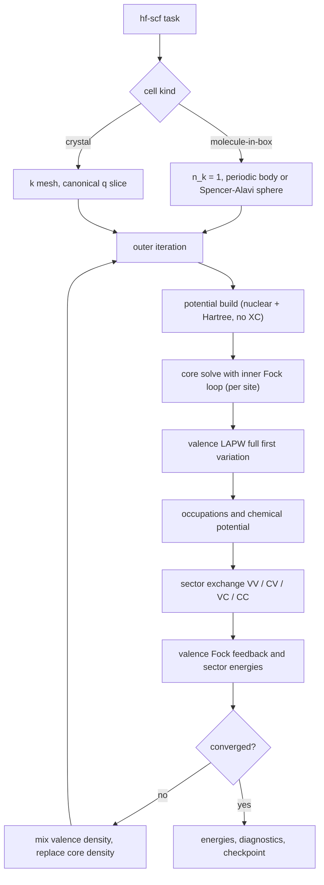
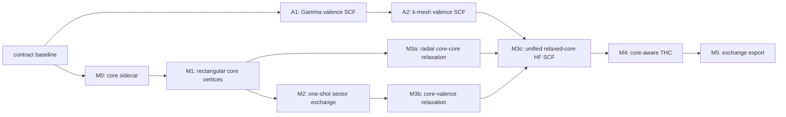

# 23. Core–valence exchange and the unified Hartree–Fock driver

This document is a contract: formulas, IR shapes, stage boundaries, and
acceptance gates. A1 and A2 are implemented as described in section 4.1, and
M0, M1, and M2 are implemented as described in section 4.2. M3a and M3b are
also implemented, including the shared relaxed-core loop with fresh CC and VC
actions at every inner iteration. M3c now closes the repository-internal
unified driver and its bounded synthetic pipeline; the external Kr AO comparison
remains blocked as recorded below. M4 core-aware THC and the M5 versioned
exchange export are implemented on the final rebuilt relaxed-core frame. The
contract lifts two explicit exclusions of
[18](18_lapw_mpb_thc_integration.md) §4 —
core–valence products and the self-consistent Fock loop — and it replaces the
earlier frozen-core staging idea with a relaxed core at FlapwMBPT parity.
The core is inherently four-component Dirac
([06](06_dirac_4c_core_and_valence.md)). The original implementation targets
the full-first-variation spinor valence path. A separate valence-only route now
converges scalar Koelling–Harmon HF before applying conventional SOC second
variation; its core-sector extension is specified below rather than
reinterpreting full-first-variation orbitals. The mixed-product basis is the
exact oracle throughout; THC never defines a sector, it only compresses one.

## 1. Formulas

### 1.1 Occupied-space decomposition and sector energies

Let $D=D_v+D_c$ split the occupied one-particle density into valence and core
parts, and let $K_B[D_A]$ denote the exchange operator generated by occupied
space $A$ and restricted to target space $B$, with $A,B\in\{v,c\}$ and the
negative sign included in $K$:

```math
K_v=K_v[D_v]+K_v[D_c],\qquad
K_c=K_c[D_v]+K_c[D_c].
```

The exchange energy is accounted per sector:

```math
E_x^{vv}=\frac{1}{2}\,\mathrm{Tr}\left(D_v K_v[D_v]\right),\qquad
E_x^{cc}=\frac{1}{2}\,\mathrm{Tr}\left(D_c K_c[D_c]\right),
```

```math
E_x^{cv}=\frac{1}{2}\left[\mathrm{Tr}\left(D_v K_v[D_c]\right)
+\mathrm{Tr}\left(D_c K_c[D_v]\right)\right].
```

The two cross traces are equal in exact arithmetic. Results must store both
traces, their average, and the mismatch residual, so the core–valence factor
of $1/2$ is never ambiguous. The total is $E_x=E_x^{vv}+E_x^{cv}+E_x^{cc}$.

The total Hartree–Fock energy uses the direct functional traces, never the
core eigenvalues of the channel-reduced core equation (section 1.4):

```math
E_{\mathrm{HF}}
=\mathrm{Tr}\left[(D_v+D_c)\,h\right]
+E_H[n_v+n_c]
+E_x^{vv}+E_x^{cv}+E_x^{cc}
+E_{\mathrm{nn}},
```

with $h$ the kinetic plus external one-body operator, $E_H$ the Hartree
energy of the total density, and $E_{\mathrm{nn}}$ the periodic Ewald or
molecular nuclear repulsion. The valence eigenvalue identity

```math
\sum_{i\in v} f_i\,\varepsilon_i
=\mathrm{Tr}\left(D_v h\right)
+\mathrm{Tr}\left(D_v V_H\right)
+\mathrm{Tr}\left(D_v K_v\right)
```

is a consistency gate; the analogous core identity carries the sphericity
error of section 1.4 and its residual is a reported diagnostic, not a gate.

### 1.2 Core shells, Bloch phase, and spill

A core spin orbital is identified by $(s,n,\kappa,2\mu)$: site, principal
quantum number, signed Dirac $\kappa$, and doubled magnetic quantum number.
The physical radial pair $(P_c,Q_c)$ is shared per shell $(s,n,\kappa)$ and
the $\mu$ degeneracy is expanded explicitly. Each spin orbital carries an
occupation $f\in[0,1]$; a closed shell has $f=1$ for every one of its
$2|\kappa|$ spin orbitals. Neither a spherically averaged core density nor a
pseudocharge may be inverted into exchange input, and a core normalized over
all space is never silently renormalized inside the muffin tin.

Core states enter the periodic problem as flat Bloch bands,

```math
\varphi_{ck}(r)=\frac{1}{\sqrt{N}}\sum_{R}
e^{ik\cdot(R+\tau_s)}\,\varphi_c(r-R-\tau_s),
```

with occupations and density independent of $k$; only the site phase depends
on $k$. This form, and the muffin-tin-only pair vertices of section 1.3, are
valid exactly when the core does not leak between images. The solver already
works on an extended mesh and reports `norm_total`, `norm_mt`, and `spill`;
the contract makes spill a gated diagnostic. A shell whose spill exceeds the
gate must be reclassified as valence or semicore (the FlapwMBPT `core_lim` /
`core_bcs` reclassification precedent), never truncated silently.

### 1.3 Rectangular sector contraction

Exchange pairs are rectangular: the occupied index and the target index run
over different spaces. The four sectors are

| Sector | Occupied space $A$ (at $k-q$) | Target space $B$ (at $k$) | Feeds |
|---|---|---|---|
| VV | valence bands | valence bands | $K_v[D_v]$ |
| CV | core spin orbitals | valence bands | $K_v[D_c]$ |
| VC | valence bands | core spin orbitals | $K_c[D_v]$ |
| CC | core spin orbitals | core spin orbitals | $K_c[D_c]$ |

The single contraction formula extends
[18](18_lapw_mpb_thc_integration.md) §2.8 to any sector:

```math
K^{x,AB}_{jj'}(k)
=-\sum_{q} w_{k-q}\sum_{i\in A} f^{A}_{i}(k-q)
\left(C^{q,AB}_{kij}\right)^{\dagger} V^{q}\, C^{q,AB}_{kij'},
\qquad j,j'\in B,
```

where $C^{q,AB}_{kij}$ is the auxiliary-basis vertex of the pair formed by
occupied state $i\in A$ at $k-q$ and target state $j\in B$ at $k$, and $V^q$
is the sampled $\zeta$ Weinert Coulomb operator of
[15](15_weinert_coulomb_metric.md). For $A=c$ the occupied index enumerates
$(s,n,\kappa,2\mu)$, $f^{c}_{i}$ does not depend on $k-q$, and only the site
phase of the vertex does. Because the core radial support ends at the
muffin-tin boundary (up to gated spill), every vertex with a core member is
muffin-tin only: its interstitial pair contraction is identically zero, and
the raw interstitial pair support of such columns is empty by contract.

Sector traces close the energy accounting of section 1.1:

```math
T_{AB}=\sum_{k} w_k\sum_{j\in B} f^{B}_{j}(k)\,K^{x,AB}_{jj}(k),
```

so $E_x^{vv}=\frac{1}{2}T_{vv}$, $E_x^{cc}=\frac{1}{2}T_{cc}$,
$E_x^{cv}=\frac{1}{2}(T_{cv}+T_{vc})$, and the stored cross-trace residual is
$|T_{cv}-T_{vc}|$.

The pair sectors follow the spinor conventions of
[18](18_lapw_mpb_thc_integration.md) §1.3: PP and QQ charge sectors only,
physical $P$ and $Q$, no $cQ$, no PQ/QP mixing.

### 1.4 Relaxed-core radial Fock equation

The core is relaxed: every outer iteration re-solves each core shell in the
current potential. In Hartree–Fock the core equation is

```math
\left(\hat h^{\mathrm{Dirac}}\!\left[V^{\mathrm{loc}}\right]
+\hat K^{\mathrm{sph}}_c\right)\varphi_c=\varepsilon_c\,\varphi_c,
```

where $\hat h^{\mathrm{Dirac}}$ is the radial four-component operator of
[06](06_dirac_4c_core_and_valence.md), $V^{\mathrm{loc}}$ is the spherical
nuclear plus Hartree potential of the full density on the extended mesh —
with no exchange–correlation surrogate — and $\hat K^{\mathrm{sph}}_c$ is the
channel-reduced exchange kernel. Its core–core part is the relativistic
closed-subshell Slater form. Production keeps the two charge sectors distinct:

```math
Y_L^{PP}(c',c;r)=\int_0^{\infty}
\frac{\min(r,r')^{L}}{\max(r,r')^{L+1}}
P_{c'}(r')P_c(r')\,dr',
```

```math
Y_L^{QQ}(c',c;r)=\int_0^{\infty}
\frac{\min(r,r')^{L}}{\max(r,r')^{L+1}}
Q_{c'}(r')Q_c(r')\,dr'.
```

PP angular contractions use $\Omega_\kappa$ and QQ contractions use
$\Omega_{-\kappa}$. Their contributions to the P and Q output actions are
formed separately, and their Coulomb interference is retained in the total
trace; no one combined $Y_L^{PP+QQ}$ or common angular factor is used. The
core–valence part is built from the site-projected occupied valence density matrix,
reduced to $l/\kappa$ channels by the same Clebsch–Gordan contraction
(the FlapwMBPT `t_x`/`t1_x` construction); the valence input itself is not
spherically restricted — only the operator acting on the core is. The core
solve iterates this kernel to inner self-consistency per shell.

The channel reduction is forced by solving a one-dimensional radial equation.
Two statements bound its cost and comparison scope:

- For uniform $\mu$ occupation per shell (spherical $D_c$), every energy
  trace of section 1.1 picks up only the spherical component of the exchange
  operator. Traces agree in exact arithmetic only when both routes use the
  same Coulomb body. The production MPB `FiniteBody` contraction includes the
  finite periodic/background body with the separated divergent Gamma head
  omitted, while the radial Slater route uses isolated onsite $1/r$.
  MPB-minus-radial CC/CV/VC values are therefore signed physical diagnostics,
  not numerical gates. The sampled radial action and its independent extended
  radial trace do use the same body and retain a numerical identity gate.
- The neglected nonspherical remainder affects only core orbital relaxation
  in a nonspherical environment. It is measured, per core spin orbital, as

```math
\delta_c=\langle\varphi_c|\,K_c^{\mathrm{exact}}-K_c^{\mathrm{sph}}\,
|\varphi_c\rangle,
```

  with $K_c^{\mathrm{exact}}$ evaluated through the MPB VC/CC vertices.
  $\delta_c$ is reported every iteration; an exact nonlocal core solve is out
  of scope (section 5).

### 1.5 Gamma and the core–valence constant mode

At $q\to0$ the auxiliary constant mode couples to the pair charge
$\langle\varphi_c|\varphi_v\rangle$. For orthogonal core and valence states
this head coupling vanishes; LAPW core–valence orthogonality is approximate
because core and valence solve different equations, so the constant-mode
component of every CV/VC vertex is measured and gated rather than assumed
zero. The Gamma policy of [18](18_lapw_mpb_thc_integration.md) §2.8 is
unchanged for the periodic kernel: explicit `FiniteBody`
(neutralizing-background convention) or `Reject`. A molecule may instead
select `CoulombKernel::SpencerAlaviSphere`, whose Gamma kernel is finite and
has no separated head. Cell size and the explicit auxiliary Fourier cutoff are
then both caller convergence parameters. No divergent head is inserted.
A converged crystal claim therefore requires a stated $k$ mesh; this contract
does not call the finite-mesh result a production periodic HF limit.

## 2. Algorithms

### 2.1 One driver for the Gamma molecule and the crystal

There is one Hartree–Fock driver. A Gamma-centered molecule-in-box and a
periodic crystal differ only in setup, never in the loop body or the
contraction path:



The AO restricted Hartree–Fock in `libmuffintin-hf` is not this driver and
never becomes it: it stays a molecular finite-basis oracle for cross-code
comparison (the Kr Dyall v2z fixture). The production molecule path is the
LAPW driver at $n_k=1$.

### 2.2 Relaxed-core outer iteration and mixing

Each outer iteration, in order: rebuild the local potential from the current
total density; re-solve every core shell with the inner exchange loop of
section 1.4; solve the valence problem with the Fock feedback
$K_v[D_v]+K_v[D_c]$ from the previous iteration's orbitals; form occupations;
rebuild all four exchange sectors; synthesize the density.

As a deliberate repository M3c design, the core density is excluded from
Pulay/Anderson mixing and is replaced fresh each iteration; only the valence
part of the regional density is mixed under the physical metric of
[17](17_minimal_dft_scf.md) §3. If density mixing of the Fock fixed point
proves unstable, Hartree-potential mixing (the FlapwMBPT non-DFT stage
choice) is the recorded fallback, as an explicit spec change rather than a
silent switch. Core convergence is reported as the maximum radial change over
shells, alongside the density metric and the sector energies.

### 2.3 MPB exact oracle first, THC second

All four sectors are first realized as exact mixed-product vertices over the
rectangular layouts, extending the selected core–valence products already
encoded in [13](13_product_space_and_lapw_mpb.md) §4 to a real runtime core
producer and a CC enumeration. Only after the rectangular oracle passes its
gates is THC selection and fitting extended to core-aware columns. THC must
then report `residual_vv`, `residual_cv`, `residual_vc`, and `residual_cc`
separately against the MPB oracle — a single pooled residual would let the
more numerous VV columns dominate AllQL2 selection and hide a bad core fit.

## 3. Implementation

Bindings named here are planned unless marked existing or assigned to the
implemented A1, A2, or M0–M3c milestones.

### 3.1 Existing seams

| Seam | Anchor | Status |
|---|---|---|
| Core radial solve | `solve_core_dirac`, `CoreDiracSolution` in `crates/mt-sphere/src/core_dirac.rs` | exists; reports physical $P/Q$, `norm_mt`, `spill` |
| Per-iteration core station | `solve_regional_core`, `CoreShellOrbitals` in `crates/mt-dft/src/core_station.rs` | M0; retains physical $P/Q$, occupations, norms, spill, and provenance beside the unchanged density path |
| Core radials in the product IR | `DiracSiteRadialSet::cores`, `ProductOrbitalKind::Core` in `crates/mt-prodbasis/src/dirac.rs` | M1; runtime fills the core table from the retained sidecar |
| Rectangular sector layout and vertices | `ExchangePairLayout` in `crates/mt-prodbasis/src/pair_layout.rs`, `build_spinor_exchange_mpb` in `crates/mt-runtime/src/spinor_exchange_mpb.rs` | M1; independent CV, VC, and CC layouts with muffin-tin PP/QQ core products |
| Exchange contraction | `build_scalar_isdf_exchange`, `build_spinor_isdf_exchange`, `contract_rectangular_exchange` in `crates/mt-runtime/src/isdf_exchange.rs` | exists; square valence and rectangular occupied-target contractions |
| Exact full-VV exchange | `build_spinor_mpb_exchange` in `crates/mt-runtime/src/isdf_exchange.rs` | A1; requires every VV column exactly once and seals the full live orbital payload |
| Nonorthogonal feedback lift | `lift_band_hermitian_feedback` in `crates/mt-operators/src/eigensolve.rs` | A1; forms `S C K C^H S` and re-solves the retained original H0/S problem |
| Gamma valence HF driver | `run_gamma_valence_hf` in `crates/mt-runtime/src/hf_scf.rs` | A1; spinor-first, one k point, finite Gamma body, no core states |
| Full-BZ valence HF engine | `run_valence_hf` in `crates/mt-runtime/src/hf_scf.rs` | A2; explicit full regular mesh, complete fresh canonical q slice, no core states |
| Unified relaxed-core HF engine | `run_relaxed_core_hf` in `crates/mt-runtime/src/hf_scf.rs` | M3c; the Gamma wrapper validates only the molecule topology and explicit `FiniteBody`, then calls this same regular-mesh loop |
| Split initial HF density and no-XC core bootstrap | `initial_density_components`, `bootstrap_hf_core` in `crates/mt-dft/src/material_kernel.rs` | M3c; preserves separate valence/core/total state and builds core sidecars from nuclear plus Hartree electrostatics |
| Fresh relaxed-core density and direct core H0 trace | `build_regional_core_contribution_from_sidecar`, `core_local_one_body_trace` in `crates/mt-dft/src/core_station.rs` | M3c; consumes retained physical sidecars without reconstruction or core-eigenvalue energy substitution |
| Frozen sector exchange | `build_frozen_spinor_sector_exchange` in `crates/mt-runtime/src/spinor_sector_exchange.rs` | M2; one-shot VV/CV/VC/CC accounting on one sealed frozen snapshot |
| Independent radial comparison | `radial_slater_traces` in `crates/mt-coulomb`, `compare_frozen_sector_radial` in `crates/mt-runtime/src/spinor_sector_exchange.rs` | M2; trace-only MT oracle with numerical and spill gates kept separate |
| Sharp-core fixture flag | `PairColumnLayout::core_orbital` in `crates/mt-prodbasis/src/pair_layout.rs` | fixture-only; must not model real cores |
| Molecular AO oracle | `solve_restricted_hf` in `crates/mt-hf/src/lib.rs` | exists; external comparison only |

### 3.2 Planned IR

The core station keeps what it already computes instead of discarding it:

```text
CoreShellOrbitals                  (one site)
├─ site_index, site_id
├─ extended_mesh                   (beyond the muffin-tin radius)
├─ shells: [CoreShellOrbital]
│   ├─ state (n, kappa), energy
│   ├─ p, q                        (physical P/Q on extended_mesh)
│   ├─ norm_total, norm_mt, spill
│   └─ occupations: [(twice_mu, f)]
└─ provenance                      (potential build and solve spec identity)
```

Rectangular sectors get their own layout; `PairColumnLayout` and its
`core_orbital` fixture flag stay untouched:

```text
ExchangePairLayout
├─ occupied_space: ExchangeSpace   (Valence | Core)
├─ target_space:   ExchangeSpace
├─ n_k, n_occupied, n_target
└─ column = (k, i, j)              (i occupied at k-q, j target at k)
```

The exchange spec grows sector-aware occupations: the valence table keeps the
existing per-$k$ rows; the core table is one $k$-independent row of
$(s,n,\kappa,2\mu)$ occupations. The runtime spinor product input fills
`DiracSiteRadialSet::cores` from the `CoreShellOrbitals` sidecar; per the
muffin-tin-only contract of section 1.3, core-member columns carry empty raw
interstitial pair support.

### 3.3 FlapwMBPT reference anchors

Verified against the local source tree `FlapwMBPT.2106` (see
`AGENTS.local.md` for the archive location); paths are relative to that root.

| Contract point | FlapwMBPT anchor |
|---|---|
| Core re-solved every iteration in HF | `src/core_all.F` called unconditionally from the `src/solid_scf.F` main loop |
| Core sees Hartree plus explicit exchange, no XC surrogate | `src/cor_new.F` (`key1=1` branch), `src/f_ex_new.F` |
| Channel-reduced radial exchange kernels, CC and VC core-target action | `src/t_t1_x.F` (`t_x`, `t1_x`) with full valence density-matrix input |
| Exact nonlocal CV exchange in the valence Fock matrix | `src/sigx_cor_ar.F` accumulated with VV in `src/sigx_bnd_a_box.F`, rebuilt via `src/update_sx.F` |
| Muffin-tin-confined core with decay diagnostics | `src/cor_new.F` (`psi_nre`, `r_nre_core`), `src/rad_hf_check.F` |

Two deliberate divergences are explicit. FlapwMBPT builds CV exchange from direct on-site
Slater integrals and bypasses its mixed basis; this contract routes all four
sectors through the MPB auxiliary basis so the same Coulomb operator, Gamma
policy, and THC compression cover every sector, and so inter-site CV coupling
needs no separate machinery. The FlapwMBPT route confirms that muffin-tin-only
CV exchange is adequate under a spill gate. This repository's M3c also mixes
only valence density and replaces core density fresh. The inspected
`src/mixro1.F` instead mixes total density and is not evidence for that choice.

## 4. Milestones and acceptance gates

The driver and core-sector work advance as two mostly independent tracks.
Track A first closes the valence-only Fock loop; Track B builds the core
sidecar and rectangular exchange sectors. They join only at the relaxed-core
driver milestone:

### 4.1 Valence track and staging graph



#### A1 — Gamma valence-only SCF

A1 implements the first executable driver stage as a Gamma-centered
molecule-in-box, valence-only Hartree–Fock SCF loop. It fixes `n_k = 1` and
uses `GammaExchangeTreatment::FiniteBody`; core exchange and core relaxation
remain outside this stage. Whenever the valence orbitals change, the driver
rebuilds every VV MPB vertex, assembles the MPB Coulomb body, contracts the new
VV exchange, and feeds its Hermitian band-basis Fock matrix into the next
valence solve. The MPB frozen identity includes the complete eigenvector and
basis payload, so a rotated live orbital set rejects an old context. THC
remains an optional frozen-orbital backend and does not define A1 feedback.

Within one fixed nuclear-plus-Hartree potential, each k-point frame retains
its original local H0/S problem. A fresh band matrix is lifted as
$S C K C^\dagger S$, added to H0, and solved again; it is never added to old Fock
eigenvalues. The inner Fock iteration may rebuild vertices as orbitals rotate
because its radial basis is fixed. After regional density mixing, the next
outer iteration rebuilds the Hartree potential and rematerializes the radial
basis before starting a new inner loop, so feedback is never moved between
incompatible radial frames.

`GammaValenceHfSpec::fock_mixing` explicitly controls consecutive lifted
physical-basis exchange operators inside one fixed H0/S frame. The
`CommutatorDiis` path forms the density matrix $D=C f C^\dagger$, constructs
the fresh Fock matrix $F=H_0+K[D]$, and uses $SDF-FDS$ as its CDIIS error.
For a full regular mesh, the error blocks are weighted by the square root of
the corresponding $k$ weight and concatenated before the constrained DIIS
solve. The coefficients sum to one, so extrapolating only $K[D]$ is equivalent
to extrapolating the full Fock matrix while keeping $H_0$ fixed. The error is
always represented in the global basis rather than a changing orbital gauge.
Both commutator variants may delay DIIS by an explicit number of startup
updates. During that interval the fresh feedback is damped against the prior
feedback; no startup vector is inserted into the later DIIS history. Zero
startup steps and zero damping recover immediate CDIIS.
`QuasiNewtonDiis` additionally divides the commutator in the instantaneous
orbital basis by $|\varepsilon_a-\varepsilon_i|+\lambda$ and lifts the result
back to the same global basis before building the DIIS metric. This is a
diagonal orbital-Hessian preconditioner, not a full Newton response or an
evaluation of $\delta K[\delta P]$.
This is a recorded Fock iteration control, not a silent fallback and not a
replacement for the outer regional-density mixer.

The driver reports the anti-Hermitian residual, Fock fixed-point residual,
regional density RMS, electron count, exchange and total energies, the direct
exchange/eigenvalue/total-energy identities of section 1.1, and the
$C^\dagger (S C K C^\dagger S) C = K$ residual. Its first global solve is also
checked against $\mathrm{diag}(\varepsilon_0)+K$. The first driver rebuild is compared with an
independent one-shot full-VV rebuild before any orbital update. The AO
restricted Hartree–Fock Kr Dyall v2z fixture is an external numerical oracle
only; it does not supply the production loop, basis, or convergence policy.
A1 returns only when these algebraic gates and both the inner Fock and outer
regional-density fixed points pass the requested tolerances. A bounded
`FockNotConverged` or `NotConverged` is explicit otherwise. This is an
implementation and pipeline gate only: no single cell is called converged
with respect to molecule box size, basis, product cutoff, or physical energy.

#### A2 — Regular k-mesh valence-only SCF

A2 implements the A1 loop on an explicit full regular crystal $k$ mesh. The
physical points are $k_i=(i+s)/N$ with the caller's shift $s$, while canonical
transfers are the distinct unshifted points $q_i=i/N$. For every $q$, the
$k\mapsto k-q$ table is validated as a permutation of the same shifted mesh,
including its integer Umklapp identity. Symmetry-reduced input is rejected at
the driver boundary rather than silently expanded.

After every orbital update, each iteration rebuilds the complete canonical
$q$ slice and every VV MPB vertex from the same live all-$k$ frame. No
canonical slice, vertex, or Coulomb record from preceding orbitals is reused.
The exchange contraction applies occupied-side $w_{k-q}f$ once; the energy
trace applies outer $w_kf$ once. There is no $q$ weight, implicit spin
degeneracy, or extra weight on the band-space feedback. Each Hermitian
$K(k)$ is lifted only through the physical frame that generated it.

The gates require that the $1\times1\times1$ generic setup agrees with the
strict Gamma molecule route for the same cell, orbitals, and `FiniteBody`
policy, and that the frozen-orbital one-shot VV result on a regular mesh equals
the first SCF iteration before any orbital update. A shifted
$2\times2\times1$ topology gate
locks the q ordering, permutation, and Umklapp conventions. The repository
has no independent crystal Hartree–Fock oracle, so these are internal
path-equivalence gates, not external validation. A returned state is a fixed
point only on its specified finite full-BZ mesh. Convergence in $k$ mesh,
basis, product cutoff, and molecule box size remains a caller study; A2 makes
no claim of a converged periodic Hartree–Fock limit.

#### A3 — Scalar KH HF and SOC second variation

`run_kh_soc_valence_hf` uses a converged scalar KH-Fock solve only to generate
the fixed source-band frame for each outer Hartree step. It projects the
SPEX-form $\xi(r)\mathbf L\cdot\mathbf S$ operator into that frame, subtracts
the complete scalar VV plus scalar-averaged frozen-core feedback already
contained in the source eigenvalues, and replaces them by resolved frozen-core
exchange plus the current Pauli-spinor VV exchange. Consequently the solved
operator is the projected scalar local Hamiltonian plus SOC, resolved core
exchange, and one copy of the live spinor VV operator; neither scalar exchange
nor core exchange is counted twice.

The scalar KH source and Pauli-spinor loops own separate explicit Fock mixers;
their maps have different conditioning, so a preconditioner chosen for the
spinor loop is not silently imposed on the scalar source. Every spinor Fock
iteration rebuilds the up/down-summed pair vertices from the
current SOC orbitals on a cached scalar mixed-product basis and cached Coulomb
operator. The band matrix is lifted to the fixed doubled scalar-band frame.
CDIIS forms the full Pauli density matrix there and uses its ordinary
commutator with the current spinor Fock matrix, so both diagonal-spin and
spin-off-diagonal channels enter one consistent error vector. The converged
spinor inner loop requires both the regional-density residual and the maximum
matrix element of this weighted commutator to meet their explicit tolerances.
The change in the complete feedback matrix remains a diagnostic rather than a
convergence gate because rotations inside an unoccupied near-degenerate
subspace can change that representation without changing the occupied density
or satisfying direction. A second feedback residual is projected into the
current spinor orbital frame and retains every matrix element with at least one
occupied endpoint. This active block is a convergence gate, so occupied
orbital energies cannot remain tied to an older extrapolated Fock operator;
pure virtual–virtual changes are still excluded. The converged spinor density
and spinor HF energy,
not the scalar source result, define the outer density and energy fixed point.
Diagnostics retain separate scalar and spinor iteration/rebuild counts, the
commutator residual, the feedback change, and the scalar-to-spinor density
change. The outer density residual is also decomposed into muffin-tin and
interstitial RMS contributions whose squares sum to the reported total, so a
molecule-in-box run can distinguish physical sphere relaxation from
interstitial-vacuum noise before changing its mixing metric.

The spinor eigenvalue and total-energy identity gates scale with the electron
count and the same commutator tolerance. The scalar-source identities remain
tied to the scalar feedback tolerance because that loop retains its
fresh-feedback convergence contract.

Frozen core remains a separate radial sidecar and does not enlarge the VV MPB
or THC orbital span. Its spherical scalar-average action is used only in the
source solve; the SOC frame replaces it by the complete spin-resolved static
core action. Relaxed KH+SOC core is intentionally not implemented because it
would require a four-component VC action generated from scalar/SOC valence
states rather than a signed $\kappa$ approximation.

| Milestone | Deliverable | Exit gates |
|---|---|---|
| M0 | Implemented: core station retains and outputs the `CoreShellOrbitals` sidecar | sidecar radials bit-identical to the density path; `norm_mt` and spill reported per shell; no consumer change |
| M1 | Implemented: rectangular MPB CV/VC/CC vertices over `ExchangePairLayout`; runtime core producer fills `DiracSiteRadialSet::cores` | cross-trace residual at numerical tolerance; occupation factors applied exactly once; PP/QQ sectors only; Bloch/site phase locked by a single-shell analytic fixture; CV constant-mode residual reported |
| M2 | Implemented: sector-aware one-shot exact-MPB traces and exchange energies on one converged frozen DFT snapshot, plus an independent trace-only radial Slater oracle | VV adapter reproduces the square contraction; CV and VC are contracted independently; signed finite-body MPB-minus-onsite-radial differences are reported; radial imaginary residual and physical core spill are separate gates |
| M3a | Implemented: channel-reduced radial core-core Fock kernel with per-shell inner self-consistency | converged core shells; finite-body MPB-minus-onsite-radial CC difference is reported; final CC action matches the extended radial trace numerically; extended-minus-MT spill is reported separately |
| M3b | Implemented: complete site-valence density, channel-reduced radial VC action, CV/VC-only exact MPB contraction, per-core $\delta_c$, and shared CC+VC core relaxation | production VC action matches the independent radial oracle; MPB CV and VC traces agree; their finite-body difference from the spherical on-site action is reported and closes through weighted $\delta_c$; imaginary residual and shell spill gated; final VC action rebuilt from final core radials |
| M3c | Implemented internally: unified Track A2 valence driver and relaxed core with full CV feedback | bounded neutral closed-shell synthetic pipeline gates the density fixed point, valence eigenvalue identity, core convergence, fresh-core replacement, total-density mixing, VV+CV feedback, and Gamma/generic parity; external Kr AO comparison remains blocked by the missing checked-in LAPW molecule/box-series fixture and acceptance tolerance |
| M4 | Implemented: core-aware THC selection and fit over exact rectangular VV/CV/VC/CC layouts, with MPB quadratic forms as the representation-neutral oracle | four sector-resolved fit residuals and four sector-resolved MPB quadratic residuals reported separately; every sector column enters the pooled selector; rank and column scaling reported |
| M5 | Implemented: MLDUMP/pyexport v2 with sector energies and exchange provenance | schema versioned; the common payload remains a strict spinor v1 payload; v1 files remain exchange-absent; final-frame and energy identities preflighted |

### 4.2 Core-sector track and relaxed-core merge

M0 is the implemented Track B entry point. It introduces only the
`CoreShellOrbitals` sidecar at the core-station boundary. For every solved
shell, the sidecar retains the existing extended mesh, physical $P/Q$
radials, energy, `norm_total`, `norm_mt`, spill, occupations, and solve
provenance without resampling, renormalization, or reconstruction. Density
synthesis continues to consume the same solver output through the unchanged
path and must remain bit-identical. No exchange, product-basis, or other
consumer changes in M0.

M0 is independent of the Track A valence work: either track may land first,
and neither blocks progress or changes the acceptance gates of the other.
They meet only at the later relaxed-core merge stages specified below.

M1 implements rectangular MPB vertices for the CV, VC, and CC sectors,
each enumerated by its own `ExchangePairLayout`. The runtime product input
fills `DiracSiteRadialSet::cores` from the M0 sidecar. Any column with a core
member has empty interstitial support and carries only the muffin-tin PP and
QQ radial products; no PQ or QP sector is introduced. The occupation factor
is applied exactly once in the exchange trace. Bloch translation and site
phase conventions are shared by the forward and reverse rectangular
layouts rather than inferred independently.

The M1 gate compares the CV and VC cross traces at numerical tolerance,
locks the Bloch/site phase with the single-shell analytic fixture, and
reports the CV constant-mode residual. A failure of any one of these checks
blocks sector-energy work even if the individual vertex norms look correct.

M2 is a one-shot evaluator on converged DFT orbitals. It reports
$E_x^{vv}$, $E_x^{cv}$, and $E_x^{cc}$ for the molecule and crystal routes
without entering an SCF loop, updating orbitals, or feeding exchange back
into a density. It may therefore proceed in parallel with Track A and does
not require the Track A valence driver.

The implementation surface is `build_frozen_spinor_sector_exchange`. A single
`SectorOccupations` snapshot supplies k weights plus valence and flat-core
occupations. The shared rectangular exact-MPB kernel applies the occupied-side
factor once and the target trace applies its density factor once; there is no
q weight. The result stores independent `Tvv`, `Tcv`, `Tvc`, and `Tcc` sector
records, the cross average and mismatch, Hermiticity residuals, and a private
copy of the complete frozen orbital/core/q/request context for freshness
checks. The existing VV API is an adapter to the same rectangular kernel.

`radial_slater_traces` is an independent trace-only Coulomb oracle. It borrows
physical P/Q arrays, expands explicitly mu-resolved closed shells, uses
`Omega_kappa` for PP and `Omega_-kappa` for QQ, and consumes a preweighted
Hermitian site-valence density matrix. It returns MT and extended CC traces,
their measured absolute difference, and the MT CV trace. It never constructs
MPB radial products or a sampled radial Fock kernel. `ExplicitCollinear` and
non-closed mu occupations are rejected because the required magnetic trace is
not inferable from them.

`compare_frozen_sector_radial` reports signed CC, CV, and VC finite-body
MPB-minus-onsite-radial differences. Its explicit numerical tolerance gates
the radial imaginary residual, not differences between unlike Coulomb bodies.
The extended-minus-MT CC difference remains a reported Hartree spill
allowance, while each shell's dimensionless `spill` is checked against a
separate threshold. No conversion of dimensionless norm spill into an
invented energy allowance is made.

The VV result must reproduce the existing square-layout frozen-orbital
contraction. The rectangular CV and VC cross traces must agree at numerical
tolerance. Independent channel-reduced radial Slater traces for CC and CV
provide onsite reference values; their signed differences from finite-body
MPB traces are reported rather than gated. The extended-minus-MT CC difference
and dimensionless per-shell spill are reported and gated separately rather
than absorbed into a looser numerical tolerance.

M2 remains strictly frozen and one-shot. It does not call `run_gamma_valence_hf`,
the regular-k Track A2 driver, any mixer, any core solver, or any orbital/density
feedback path. Passing its focused algebraic and radial-oracle gates is not an
SCF convergence claim.

M3a may begin as soon as M1 closes and does not wait for Track A2. It adds the
channel-reduced radial core-core Fock kernel and a per-shell inner iteration
at fixed outer potential. The independent MPB CC contraction remains its
finite-body oracle, but its signed difference from the isolated onsite MT
radial trace is physical and is not gated. The final CC action independently
matches the extended radial trace at the explicit numerical tolerance. The
extended-minus-MT trace difference is reported as spill evidence and is never
folded into that tolerance.

M3b follows M2. It builds the complete
Hermitian site-valence density as
$D_{ab}=\sum_{kn}w_k f_{kn}d^*_{akn}d_{bkn}$ exactly once, with no $q$ weight,
spin multiplier, or overlap insertion. The production radial action keeps the
PP $\Omega_\kappa$ and QQ $\Omega_{-\kappa}$ reductions separate, averages
only over the target-core magnetic channels, acts on physical P/Q, and is
zero outside the muffin tin. Core occupation enters only its final trace.

The CV/VC-only exact-MPB contraction exposes the VC diagonal weighted over
$k$ for every flat core spin orbital. M3b reports
$\delta_c=\langle\varphi_c|K_c^{\mathrm{exact}}-K_c^{\mathrm{sph}}|\varphi_c\rangle$
per core target without bounding an individual $\delta_c$. It gates only the weighted closure
against $T_{vc}^{\mathrm{MPB}}-T_{vc}^{\mathrm{radial}}$, alongside explicit
production-action versus independent-radial, MPB CV-versus-VC cross-trace,
imaginary-residual, and dimensionless shell-spill gates. The full finite-body
MPB traces are not required to equal the spherical on-site radial action;
their differences are physical diagnostics closed by the weighted $\delta_c$.
All builders seal the complete
orbital, basis, radial, q-map, request where applicable, weight, and occupation
context. The shared fixed-potential core loop holds that valence density fixed,
rebuilds the VC action from the latest core Picard iterate, adds fresh CC and
VC before action mixing and energy prediction, and reports their traces
separately. The returned VC action remains exactly zero outside the muffin tin.
M3b still performs no density mixing or outer SCF update.

M3c is the implemented full merge. `RelaxedCoreHfSpec`,
`RelaxedCoreHfResult`, and `RelaxedCoreHfIterationDiagnostic` expose one
regular-mesh engine. `run_gamma_relaxed_core_hf` checks only the $1\times1\times1$
zero-shift full mesh and explicit `FiniteBody` policy before calling that same
engine. The driver combines Track A2 with the relaxed Fock core, gives the
valence equation VV+CV feedback and the core equation CC+VC feedback, rebuilds
the core density fresh on every outer iteration, and mixes the complete total
density. The fresh core density is subtracted from the mixed total to recover
the next valence input. Every live orbital update rebuilds VV, CV, VC, and CC from one complete
canonical $q$ slice carrying the same fresh core sidecars. Final $\delta_c$
diagnostics are formed from that final rebuilt frame rather than the bootstrap
or pre-update sidecars.

The total energy uses the direct valence and core local-Hamiltonian traces,
total-density Hartree double-counting correction, all four sector energies,
and nuclear repulsion. It does not infer the core one-body trace from relaxed
channel eigenvalues. The checked-in neutral closed-shell synthetic pipeline is
an internal path and identity gate only. The repository still has no checked-in
Kr LAPW molecule-in-box checkpoint, box-size series, paired basis/product-cutoff
series, or agreed AO-to-LAPW acceptance tolerance. Consequently the existing
Kr Dyall v2z AO record is not claimed as an M3c external numerical validation;
that comparison remains an explicit fixture blocker rather than an invented
tolerance.

M4 keeps the existing VV-only `build_spinor_thc` route unchanged and adds a
rectangular core-aware route. `build_spinor_sector_thc` collocates physical
valence and core spinors on one parent grid. A core orbital is nonzero only in
its owning muffin tin, uses its physical P/Q radial arrays with
$\Omega_{\kappa\mu}$ and $\Omega_{-\kappa\mu}$, and contributes no
interstitial sample. Occupations are absent from collocation and vertices and
enter only the later exchange contraction.

The selector matrix has the stable row order q-major, then VV, CV, VC, CC,
then the exact `ExchangePairLayout` column order. Every rectangular pair
column enters that matrix; QRCP or pivoted Cholesky selects parent-grid points,
not pair columns. One selected point set is shared by all transfers and one
$\zeta$ is fitted per transfer against all four sectors without sector quotas
or implicit balancing. The result records the four weighted L2 residuals
separately and reports $N_k$, $N_v$, $N_c$, candidate count, effective rank,
all four column counts, pooled columns per transfer, and total selector rows.

`compare_spinor_sector_thc_mpb` is the M4 representation-neutral oracle. It
requires complete exact-MPB VV, CV, VC, and CC column sets and compares the
matched scalar quadratic forms $c^\dagger Vc$ for every pair. It does not
compare coefficient vectors, action norms, or auxiliary subspaces across MPB
and THC. Maximum absolute and relative discrepancies, including the worst
transfer and column, are retained independently for VV, CV, VC, and CC. No
acceptance threshold is invented at this stage; rank convergence remains an
explicit caller study over the reported diagnostics.

M5 adds `write_spinor_mldump_v2` without changing
`write_spinor_mldump` or the v1 schema. The writer first preflights one exact
final frame across `RelaxedCoreHfResult::final_exchange_inputs`, the sealed
exact sector exchange, the VV THC/Coulomb objects, the core-aware THC result,
and its MPB comparison. The header's ordered k points, canonical q points, and
k weights must match that same result. Only then does the existing v1 writer
emit orbitals, products, VV THC, and sampled Coulomb. That intermediate file is
a complete valid spinor v1 file; the IO upgrader changes it to v2 by adding the
typed exchange summary.

The v2 exchange payload stores all four rectangular layouts and traces; the
VV, CV, CC, and total exchange energies; the CV/VC average and mismatch; the
four aggregate THC fit residuals; and the four MPB quadratic maxima with their
worst q and column indices. Its provenance records the explicit finite-body or
reject Gamma policy, exact MPB cutoffs and tolerance, Weinert `LEXP`, the
sampled interpolation projection, selector strategy and engine, requested and
effective rank accounting, k weights, valence occupations, and the canonical
flat core occupation table. The source-frame and backend labels are fixed
schema strings for the final rebuilt relaxed-core frame and the core-aware THC
plus exact-MPB-oracle route; they are not inferred from display provenance.

Preflight rechecks the four layout dimensions, rank and selector-row
relations, finite fit residuals, complete MPB pair coverage, maxima and worst
indices, and the exact energy identities of section 1.1. It also reconstructs
`SectorOccupations` from result weights and occupations plus the final flat
core table and requires the sealed exact exchange to match that snapshot and
the `RelaxedCoreHfSpec` Coulomb/Gamma controls. The M5 summary deliberately
does not export per-core $\delta_c$, iteration history, or band-space target
matrices.

Before M3c, bring-up may run the valence driver against a core solved in the
current DFT-style local potential solely as a test harness. That core carries
an uncancelled core self-interaction, so the configuration is not a
publishable result or a shippable mode. The production exit is M3c with the
relaxed Fock core.

### 4.3 CoQui core-policy slot

The CoQui handoff keeps the downstream core policy separate from the product
space used to obtain the converged libmuffintin frame:

| Policy | CoQui active orbital space | Interaction handoff | Status |
|---|---|---|---|
| `FrozenCore` | valence only | VV THC plus the one-body contribution of the final internally relaxed core | planned first route |
| `RelaxedCore` | valence and explicit core orbitals | a unified active-space interaction covering VV, CV, VC, and CC, together with a core-update/rebuild contract | reserved, not implemented |

`FrozenCore` at this boundary does not require a DFT-frozen core. The producer
may first converge the M3c relaxed-core loop and freeze only that final core
frame for CoQui. The `RelaxedCore` slot is deferred because the current
CoQui-native writer has neither a typed core-radial update handshake nor a
contract for rebuilding all core-member interaction factors after an update.
Until both exist, exporting explicit mutable core orbitals would create a
stale interaction after the first core update.

This future slot is an interface and schema reservation, not a numerical
reservation. The VV mixed-product basis remains VV-only for both policies;
no unused core products are added to it. If `RelaxedCore` is implemented, its
unified active-space interaction is built as a separate product rather than
by enlarging every existing VV contraction.

## 5. Explicit exclusions

This contract does not include:

- an exact nonlocal core equation beyond the channel-reduced kernel; the
  remainder is measured by $\delta_c$, not modeled;
- core rotation into the valence window (semicore promotion is
  reclassification, not hybridization);
- analytic Gamma-head integration, truncated or isolated Coulomb kernels,
  and any claim of a converged periodic HF limit at a fixed $k$ mesh;
- a scalar-relativistic HF route (spinor-first);
- core contributions to polarizability or screening (the FlapwMBPT
  `core_corr` analogue belongs to a later GW/RPA contract);
- forces, or any M5 extension beyond the bounded exchange summary described
  above;
- retiring or extending the AO oracle in `libmuffintin-hf` beyond its
  comparison role.
